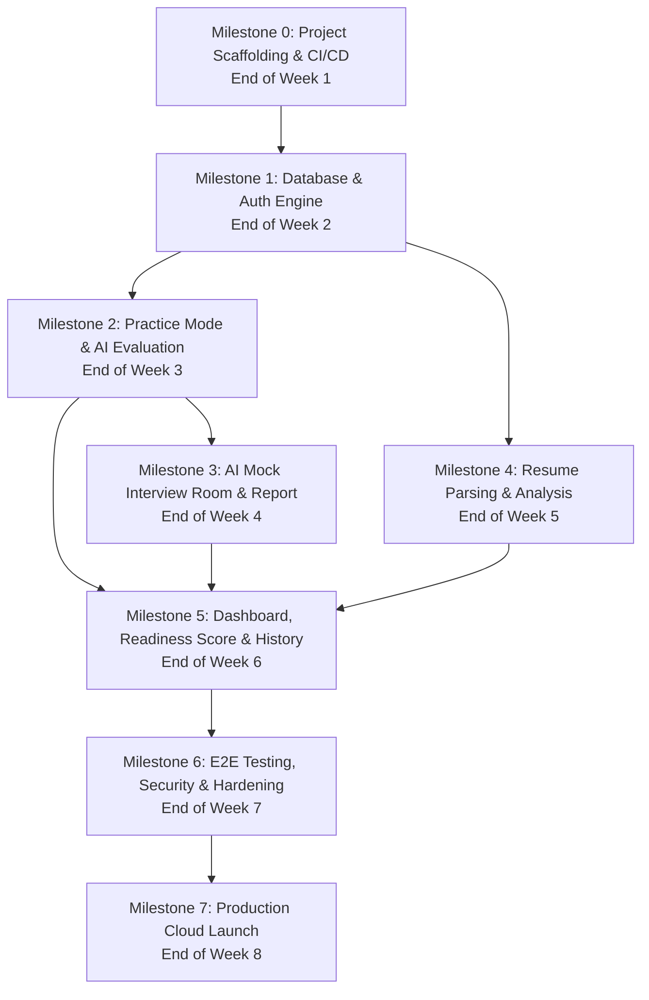

# Development Plan & Implementation Roadmap

## AI Interview Simulation System — Interview Copilot

| Field | Detail |
|---|---|
| **Product Name** | Interview Copilot |
| **Document Type** | Comprehensive Development Plan, WBS & Engineering Roadmap |
| **Version** | 1.0 (MVP) |
| **Date** | August 26, 2026 |
| **Status** | Ready for Execution |
| **Tech Stack** | React 18 · Vite 5 · Java 17 / Spring Boot 3.x · MongoDB Atlas · AI Service (OpenAI/Gemini) |
| **Parent Docs** | [PRD.md](file:///c:/Users/bombe/OneDrive/Desktop/Interview%20Copilot/docs/PRD.md) · [SRS.md](file:///c:/Users/bombe/OneDrive/Desktop/Interview%20Copilot/docs/SRS.md) · [SystemArchitecture.md](file:///c:/Users/bombe/OneDrive/Desktop/Interview%20Copilot/docs/SystemArchitecture.md) · [UI_UX_DESIGN.md](file:///c:/Users/bombe/OneDrive/Desktop/Interview%20Copilot/docs/UI_UX_DESIGN.md) |

---

## Table of Contents

1. [Executive Summary & Scope Baseline](#1-executive-summary--scope-baseline)
2. [Project Setup & Technology Stack Matrix](#2-project-setup--technology-stack-matrix)
3. [Phase-by-Phase Implementation Roadmap](#3-phase-by-phase-implementation-roadmap)
   - [Phase 0: Environment Setup, Scaffolding & CI/CD](#phase-0-environment-setup-scaffolding--cicd-week-1--sprint-0)
   - [Phase 1: Data Modeling, Database & Authentication Engine](#phase-1-data-modeling-database--authentication-engine-week-2--sprint-1)
   - [Phase 2: Question Practice Engine & AI Evaluation Pipeline](#phase-2-question-practice-engine--ai-evaluation-pipeline-week-3--sprint-2)
   - [Phase 3: AI Mock Interview Engine & Real-Time Room](#phase-3-ai-mock-interview-engine--real-time-room-week-4--sprint-3)
   - [Phase 4: Resume Parsing, AI Analysis & Recommendation Engine](#phase-4-resume-parsing-ai-analysis--recommendation-engine-week-5--sprint-4)
   - [Phase 5: User Dashboard, Analytics, History & Readiness Score](#phase-5-user-dashboard-analytics-history--readiness-score-week-6--sprint-5)
   - [Phase 6: Integration, E2E Testing, Security Hardening & Bug Squashing](#phase-6-integration-e2e-testing-security-hardening--bug-squashing-week-7--sprint-6)
   - [Phase 7: Production Deployment, Observability & Launch](#phase-7-production-deployment-observability--launch-week-8--sprint-7)
4. [Milestone Schedule & Dependency Graph](#4-milestone-schedule--dependency-graph)
5. [Task Priority Matrix (MoSCoW Framework)](#5-task-priority-matrix-moscow-framework)
6. [Definition of Done (DoD) & Quality Gates](#6-definition-of-done-dod--quality-gates)
7. [Risk Management & Mitigation Matrix](#7-risk-management--mitigation-matrix)
8. [Developer Quickstart & Execution Checklist](#8-developer-quickstart--execution-checklist)

---

## 1. Executive Summary & Scope Baseline

The objective of this development plan is to transition the **Interview Copilot** platform from architectural specifications to a fully functional, production-ready MVP.

### 1.1 In-Scope (MVP Core Deliverables)

1. **User Authentication & Profile Management:** Email/password registration, Google OAuth 2.0, JWT session management, Target Role & Company configuration.
2. **Question Practice Module:** 50+ curated DSA, CS fundamentals, and HR questions with search, multi-dimensional filtering, split-pane IDE workspace, and instant AI evaluation.
3. **AI Mock Interview Engine:** Time-bound (15/30 min) adaptive interview sessions, live countdown timer, auto-submission, full Q&A transcript logging, and comprehensive multidimensional evaluation reports (Overall score, radar chart, strengths/weaknesses).
4. **Resume Upload & AI Analyzer:** PDF text extraction (Apache PDFBox), target role alignment scoring, keyword gap analysis, and section-by-section suggestions.
5. **Personalized Dashboard & Analytics:** Dynamic Interview Readiness Score calculation (0–100), performance trend charts, weakness heatmaps, and AI topic recommendations.

### 1.2 Out-of-Scope (Deferred to Post-MVP)

- Live voice / audio streaming (WebRTC / real-time STT).
- Live code execution sandbox (Dockerized code runner).
- Peer leaderboards, social sharing, and community forums.
- Payment gateway and premium tier subscription billing.

---

## 2. Project Setup & Technology Stack Matrix

```mermaid
graph TD
    subgraph Frontend["Frontend Repository (/frontend)"]
        React["React 18 + Vite 5"]
        TW["Tailwind CSS 3"]
        State["Zustand (Auth, Session, Practice)"]
        Charts["Recharts (Radar, Line, Bar)"]
        Icons["Lucide React"]
        Router["React Router 6"]
        HTTP["Axios (JWT Interceptor)"]
    end

    subgraph Backend["Backend Repository (/backend)"]
        Spring["Spring Boot 3.x (Java 17)"]
        Security["Spring Security 6 (JWT + OAuth2)"]
        WebClient["Spring WebFlux WebClient (AI Service)"]
        PDF["Apache PDFBox 3.x (Resume Parser)"]
        Validation["Hibernate Validator"]
    end

    subgraph Infrastructure["Data & External Services"]
        MongoDB[(MongoDB Atlas M0/M10)]
        OpenAI["OpenAI GPT-4o-mini / Gemini Flash API"]
        Railway["Railway / Render / Vercel Cloud"]
        GitHub["GitHub Actions CI/CD"]
    end

    Frontend -->|REST API (JSON over HTTPS)| Backend
    Backend --> MongoDB
    Backend --> OpenAI
```

| Layer | Technology | Version | Purpose |
|---|---|---|---|
| **Frontend Framework** | React | `18.2+` | Declarative, component-based UI |
| **Frontend Build Tool** | Vite | `5.x` | High-speed HMR and optimized production bundles |
| **Styling & Design** | Tailwind CSS | `3.4+` | Utility-first responsive design tokens |
| **State Management** | Zustand | `4.x` | Lightweight global store for auth, session, and practice |
| **Data Visualization** | Recharts | `2.x` | Score trend line charts & dimension radar charts |
| **Backend Framework** | Spring Boot | `3.2+` | Enterprise REST API and business logic orchestration |
| **Language & Runtime** | Java (JDK) | `17 LTS` | Strongly typed backend performance |
| **Security & Auth** | Spring Security + JJWT | `0.12+` | Stateless JWT auth, role validation, password hashing (BCrypt) |
| **Data Layer** | Spring Data MongoDB | `3.2+` | MongoDB Atlas driver, indexing, and aggregations |
| **Document Storage** | MongoDB Atlas | `7.0+` | Flexible JSON document storage |
| **PDF Extraction** | Apache PDFBox | `3.0+` | Server-side text parsing for resume analysis |
| **AI LLM Engine** | OpenAI API / Google Gemini | `GPT-4o-mini / Gemini 1.5 Flash` | Prompt evaluation, question generation, resume scoring |
| **CI/CD Pipeline** | GitHub Actions | `v4` | Automated linting, unit testing, and deployment triggers |

---

## 3. Phase-by-Phase Implementation Roadmap

```
========================================================================================================
TIMELINE OVERVIEW (8-WEEK SPRINT SCHEDULE)
========================================================================================================
Week 1 (Sprint 0): Environment Setup, Scaffolding, DB Provisioning & CI/CD Pipeline
Week 2 (Sprint 1): Database Schemas, Repositories & Authentication/User Profile Engine
Week 3 (Sprint 2): Question Practice Catalog, Split-Pane Workspace & AI Answer Evaluation
Week 4 (Sprint 3): AI Mock Interview Engine, Live Interview Room & Comprehensive Evaluation Report
Week 5 (Sprint 4): PDF Resume Upload, Text Extraction, AI Role Match & Recommendation Engine
Week 6 (Sprint 5): User Dashboard, Readiness Score Engine, History & Analytics Visualization
Week 7 (Sprint 6): Integration Testing, Security Hardening, Edge Cases & Bug Squashing
Week 8 (Sprint 7): Production Cloud Deployment, Observability Setup, Smoke Testing & Release
========================================================================================================
```

---

### Phase 0: Environment Setup, Scaffolding & CI/CD (Week 1 / Sprint 0)

**Goal:** Establish monorepo/folder structure, initialize build tools, establish database connectivity, configure AI sandbox keys, and set up automated CI builds.

#### Work Breakdown Structure (WBS)
1. **Repository & Directory Structure Initialization:**
   ```
   interview-copilot/
   ├── backend/               # Spring Boot 3 Maven Project
   │   ├── src/main/java/com/interviewcopilot/
   │   ├── src/main/resources/ (application.yml, application-dev.yml)
   │   └── pom.xml
   ├── frontend/              # React 18 + Vite 5 Project
   │   ├── src/ (components/, pages/, store/, api/, hooks/, types/)
   │   ├── tailwind.config.js
   │   └── package.json
   ├── docs/                  # Architecture & Requirements Specs
   ├── .github/workflows/     # CI/CD Workflows
   ├── docker-compose.yml     # Local MongoDB & Services
   └── README.md
   ```
2. **Backend Scaffolding:**
   - Initialize Spring Boot 3.x project with dependencies: `Spring Web`, `Spring Security`, `Spring Data MongoDB`, `Spring Boot Actuator`, `Spring Validation`, `Spring WebFlux`, `Lombok`, `jjwt`.
   - Setup global CORS configuration, custom error response wrapper (`ApiResponse<T>`), and base controller exceptions.
3. **Frontend Scaffolding:**
   - Initialize Vite + React with TypeScript template.
   - Install dependencies: `tailwindcss`, `@tailwindcss/forms`, `@tailwindcss/typography`, `lucide-react`, `recharts`, `zustand`, `axios`, `react-router-dom`.
   - Configure Tailwind tokens as defined in [UI_UX_DESIGN.md](file:///c:/Users/bombe/OneDrive/Desktop/Interview%20Copilot/docs/UI_UX_DESIGN.md).
4. **Cloud Database Provisioning:**
   - Provision MongoDB Atlas free tier cluster (M0) in closest AWS/GCP region.
   - Create application user credentials, set network access IP whitelist (`0.0.0.0/0` for dev).
5. **AI API Integration Sandbox:**
   - Create `AiClientService` interface with mock implementation for testing without burning API tokens.
   - Setup WebClient bean with timeout configurations (Connection: 5s, Read: 15s).
6. **CI Pipeline Setup:**
   - Create `.github/workflows/ci.yml` running `mvn test` and `npm run build` on every push/PR.

**Deliverables:** Clean repository builds passing in GitHub Actions; frontend loads base layout; backend connects to MongoDB Atlas.

---

### Phase 1: Data Modeling, Database & Authentication Engine (Week 2 / Sprint 1)

**Goal:** Build complete data access layer, Spring Security JWT filter chain, user registration/login endpoints, Google OAuth2 support, and user profile management.

#### Work Breakdown Structure (WBS)
1. **MongoDB Entities & Indices:**
   - `User`: Email (unique index), passwordHash, fullName, targetRole, targetCompany, experienceLevel, skillsList, preferredLanguage, createdAt, updatedAt.
   - `Question`: QuestionId (unique), title, slug, type (DSA/CS_CORE/HR), category, difficulty (EASY/MEDIUM/HARD), problemStatement, constraints, examples, idealApproach, tags.
   - `MockInterviewSession`: SessionId, userId, type, durationMinutes, status, questionsList, answersList, startedAt, completedAt.
   - `EvaluationReport`: ReportId, sessionId/questionId, userId, overallScore, dimensions (technicalAccuracy, problemSolving, communicationClarity, answerCompleteness), strengths, weaknesses, actionableNextSteps, evaluatedAt.
   - `ResumeAnalysis`: AnalysisId, userId, fileName, fileSizeBytes, roleMatchScore, matchedKeywords, missingKeywords, sectionFeedback, uploadedAt.
2. **Authentication Core (Spring Security + JJWT):**
   - Implement `JwtTokenProvider` (generate token, validate token, extract claims).
   - Implement `JwtAuthenticationFilter` and `SecurityFilterChain` permitting public endpoints (`/api/v1/auth/**`, `/api/v1/questions/**`) and protecting private routes (`/api/v1/mock/**`, `/api/v1/resume/**`, `/api/v1/users/**`).
   - Implement `AuthService`: `/api/v1/auth/register`, `/api/v1/auth/login`, `/api/v1/auth/refresh`.
   - Implement Google OAuth 2.0 token verification endpoint (`/api/v1/auth/google`).
3. **User Profile Management Endpoints:**
   - `GET /api/v1/users/me` — Retrieve current authenticated user profile and target role.
   - `PUT /api/v1/users/me` — Update target role, target company, skills tags, experience level, and preferred language.
4. **Frontend Auth & Profile Implementation:**
   - Implement Axios interceptor for JWT token injection and 401 automatic redirect.
   - Implement Zustand `useAuthStore` with persistent storage (localStorage).
   - Build **Login & Registration Screen (`S-01`)** with Google OAuth button and floating labels.
   - Build **Profile Settings Screen (`S-03`)** with searchable role dropdown and skills tag input.

**Deliverables:** Full end-to-end user registration, login, JWT token persistence, target role selection, and profile editing.

---

### Phase 2: Question Practice Engine & AI Evaluation Pipeline (Week 3 / Sprint 2)

**Goal:** Implement question catalog browsing, filtering, search, split-pane IDE workspace, and the automated AI evaluation pipeline for single answers.

#### Work Breakdown Structure (WBS)
1. **Question Bank Seeding & Repository:**
   - Create database seed script (`db/seed_questions.json`) containing 50+ curated interview questions (DSA: Arrays, Trees, Graphs, DP; CS: OS, DBMS, Networks, OOP; HR: Behavioral STAR questions).
   - Create `QuestionRepository` with MongoDB text search index and multi-field filtering (`type`, `difficulty`, `category`).
2. **Question Catalog Endpoints:**
   - `GET /api/v1/questions` — Paginated list with filters (`type`, `difficulty`, `status`, `search`).
   - `GET /api/v1/questions/{id}` — Full question details including constraints and starter code.
3. **AI Evaluation Pipeline (Single Answer):**
   - Create `PromptTemplateService` for code/answer evaluation.
   - Structured AI prompt with strict JSON schema enforcing output format:
     ```json
     {
       "score": 85,
       "timeComplexity": "O(N)",
       "spaceComplexity": "O(H)",
       "strengths": ["Clear recursion base case"],
       "weaknesses": ["Missed null root boundary condition"],
       "improvementSuggestions": ["Add explicit guard clause at top of function"]
     }
     ```
   - Implement `PracticeService`: `POST /api/v1/practice/submit` executing AI WebClient call with exponential backoff fallback.
4. **Frontend Practice Experience:**
   - Build **Question Practice Catalog (`S-04`)** with category filter pills, difficulty badges, and search bar.
   - Build **Split-Pane Practice Workspace (`S-05`)**:
     - Left Pane: Problem description, constraints, examples.
     - Right Pane: Code/Text editor container with language selector and timer.
     - Bottom Slide-Up AI Feedback Drawer with score badge (`0–40` red, `41–70` amber, `71–100` green), strengths, weaknesses, and edge cases.

**Deliverables:** Candidate can browse 50+ questions, filter by topic/difficulty, write code/answers in the split-pane workspace, submit, and receive structured AI evaluation in under 10 seconds.

---

### Phase 3: AI Mock Interview Engine & Real-Time Room (Week 4 / Sprint 3)

**Goal:** Build time-bound mock interview state machine, live interactive interview room, dynamic question progression, and aggregate multi-dimensional evaluation report.

#### Work Breakdown Structure (WBS)
1. **Mock Session State Machine & Backend Engine:**
   - Implement `MockInterviewService`:
     - `POST /api/v1/mock/start` — Initializes session with configured parameters (`type`: Technical/HR/Mixed, `duration`: 15/30m, target role context). Selects or generates initial question.
     - `POST /api/v1/mock/{sessionId}/answer` — Records candidate answer, logs timestamp, and generates adaptive follow-up or next question.
     - `POST /api/v1/mock/{sessionId}/finish` — Finalizes session, marks status `COMPLETED`, and triggers full aggregate evaluation report generation.
     - `GET /api/v1/mock/{sessionId}/report` — Fetches finalized evaluation report.
2. **Aggregate AI Evaluation Engine:**
   - Aggregate prompt combining candidate's full Q&A transcript.
   - Evaluates 4 core dimensions:
     1. **Technical Accuracy (0–100)**
     2. **Problem-Solving Approach (0–100)**
     3. **Communication Clarity (0–100)**
     4. **Answer Completeness (0–100)**
   - Produces overall session score, question-by-question comparative review, and personalized next steps.
3. **Frontend Mock Interview Room & Setup:**
   - Build **Mock Interview Setup Modal (`S-06`)** with type, duration, and target context selection.
   - Build **Live Mock Interview Room (`S-07`)**:
     - Distraction-free layout (sidebar hidden).
     - Live countdown timer with red pulsating alert under 5 minutes.
     - Question counter (`Question 3 of 7`).
     - AI question card with dynamic typing animation.
     - Code/Text response input with "Request Hint" and "Submit & Next" buttons.
     - Auto-submission trigger on timer expiry.
4. **Frontend Comprehensive Evaluation Report (`S-08`):**
   - Overall score banner with color-coded badge.
   - Recharts `<RadarChart>` visualizing the 4 dimensions.
   - Collapsible accordion for each question (Candidate Answer vs Ideal Approach vs AI Tips).
   - "Recommended Practice Topics" actionable card.

**Deliverables:** End-to-end 15/30 minute mock interview simulation that generates an interactive, multi-dimensional AI evaluation report with radar charts.

---

### Phase 4: Resume Parsing, AI Analysis & Recommendation Engine (Week 5 / Sprint 4)

**Goal:** Implement PDF resume upload, server-side text extraction using Apache PDFBox, AI-powered target role matching, keyword gap analysis, and intelligent topic recommendations.

#### Work Breakdown Structure (WBS)
1. **PDF Text Extraction & Validation Service:**
   - File validation: MIME type (`application/pdf`), maximum size (5 MB).
   - Implement `PdfParserService` using Apache PDFBox 3.x to extract text, clean whitespace, and structure headings.
   - Reject password-protected or unparseable PDFs with friendly error messages.
2. **AI Resume Analysis Pipeline:**
   - Construct prompt comparing extracted resume text against the candidate's target role & company requirements.
   - Return structured JSON:
     - `roleMatchScore`: Overall match (0–100).
     - `matchedKeywords`: Array of matching skills found.
     - `missingKeywords`: High-value missing keywords for target role.
     - `sectionFeedback`: Object with specific comments for Summary, Experience, Skills, Projects, and Education.
     - `topSuggestions`: 5 high-impact bulleted improvements.
3. **Resume Controller Endpoints:**
   - `POST /api/v1/resume/upload` — Multipart form-data upload, triggers extraction + AI analysis.
   - `GET /api/v1/resume/latest` — Retrieves latest analyzed resume report for current user.
4. **Intelligent Recommendation Engine (`RecommendationService`):**
   - Analyzes candidate's weak scoring topics across practice sessions, mock interviews, and resume missing keywords.
   - Generates top 3 prioritized action items (e.g., *"Practice Graph Algorithms (Avg 42%)"*, *"Add Docker/Kubernetes to Resume"*).
   - Endpoint: `GET /api/v1/recommendations/current`.
5. **Frontend Resume Scanner Screen (`S-09`):**
   - Drag-and-drop PDF dropzone with file size indicator.
   - Step loader animation (*"1. Extracting Text" -> "2. Matching Role" -> "3. Analyzing Gaps"*).
   - Visual Role Match Score Gauge.
   - Keyword tag chips (Green for matched, red outline for missing).
   - Collapsible section-by-section suggestion accordion.

**Deliverables:** Candidates can upload their PDF resume and receive an instant alignment score against their target role with keyword gaps and actionable suggestions.

---

### Phase 5: User Dashboard, Analytics, History & Readiness Score (Week 6 / Sprint 5)

**Goal:** Build the centralized candidate dashboard, Interview Readiness Score formula engine, historical session tracking, and visual analytics charts.

#### Work Breakdown Structure (WBS)
1. **Interview Readiness Score Calculation Engine:**
   - Calculate weighted aggregate readiness score (0–100):
     $$\text{Readiness Score} = (0.45 \times \text{Avg Mock Score}) + (0.35 \times \text{Avg Practice Score}) + (0.20 \times \text{Resume Match Score})$$
   - Default cold-start handling for new users (pro-rated based on available activities).
2. **Dashboard & Analytics Endpoints:**
   - `GET /api/v1/analytics/dashboard` — Returns readiness score, streak count, quick stats, and active weakness alert.
   - `GET /api/v1/analytics/history` — Paginated list of all past mock interviews and practice sessions.
   - `GET /api/v1/analytics/trends` — Time-series score data for plotting score evolution.
3. **Frontend Main Dashboard (`S-02`):**
   - Hero banner with Circular Readiness Radial Meter (`Recharts` / SVG) color-coded to score performance bands.
   - AI Weakness Recommendation Alert Card with direct "Practice Now" action link.
   - Quick Action Cards (Start Mock Interview, Practice DSA, Scan Resume).
   - Score Progression Line Chart (Past 10 sessions).
   - Recent Sessions preview table.
4. **Frontend History & Analytics Center (`S-10`):**
   - Filterable session history table (Date, Type, Duration, Score, View Report).
   - Topic Performance Heatmap matrix (Visual grid of topics colored green/amber/red).
   - Score Trend Chart with timeframe filters (Last 7 Days, Last 30 Days, All Time).

**Deliverables:** Fully integrated dashboard tracking readiness, historical progress charts, topic heatmaps, and personalized recommendation triggers.

---

### Phase 6: Integration, E2E Testing, Security Hardening & Bug Squashing (Week 7 / Sprint 6)

**Goal:** Conduct comprehensive end-to-end testing, harden security, implement rate limiting, handle edge cases gracefully, and verify WCAG 2.1 AA accessibility.

#### Work Breakdown Structure (WBS)
1. **Automated Integration & Unit Testing:**
   - Backend: Unit tests for services with Mockito; Integration tests for Controllers using `MockMvc` and Testcontainers for MongoDB. Target test coverage: $\ge 75\%$.
   - Frontend: Unit tests for utility functions, score badge bands, and timer state machine using Vitest + React Testing Library.
2. **AI Resilience & Rate Limiting:**
   - Implement `Bucket4j` rate limiting on Spring Boot backend (Max 10 AI evaluation requests/minute per user).
   - Implement fallback JSON parsers for malformed AI LLM outputs with automatic retry.
   - Graceful offline and API error handling UI banners with manual "Retry" actions.
3. **Security Audit & Hardening:**
   - Enforce BCrypt password hashing ($12$ rounds).
   - Verify JWT expiration (Access token: 24h, Refresh token: 7 days) and rotation.
   - Sanitize all text inputs against XSS.
   - Verify CORS headers restricting access strictly to frontend domain in production.
4. **Accessibility (a11y) & Cross-Browser Verification:**
   - Run `axe-core` accessibility audit across all 10 screens to verify WCAG 2.1 Level AA compliance.
   - Verify keyboard navigation tab orders, focus rings (`ring-2 ring-indigo-500`), and ARIA screen reader attributes (`aria-live="polite"`, `role="timer"`).
   - Test responsive behavior across Mobile (375px), Tablet (768px), and Desktop (1440px) on Chrome, Safari, Firefox, and Edge.

**Deliverables:** Zero high-severity bugs; test coverage $\ge 75\%$; all security safeguards active; 100% WCAG AA compliant.

---

### Phase 7: Production Deployment, Observability & Launch (Week 8 / Sprint 7)

**Goal:** Provision production cloud infrastructure, deploy backend and frontend services, configure custom domains with SSL, establish monitoring, and execute the final launch checklist.

#### Work Breakdown Structure (WBS)
1. **Production Infrastructure Provisioning:**
   - Backend: Deploy Spring Boot container to Railway / Render (1GB RAM, 1 vCPU minimum).
   - Frontend: Deploy Vite production build to Vercel / Netlify / Render Static with CDN distribution.
   - Database: Production MongoDB Atlas cluster with automatic daily backups and IP access rules.
2. **Secrets & Environment Variables Management:**
   - Configure production environment variables: `SPRING_PROFILES_ACTIVE=prod`, `MONGODB_URI`, `JWT_SECRET`, `AI_API_KEY`, `GOOGLE_CLIENT_ID`, `CORS_ALLOWED_ORIGINS`.
3. **Observability & Logging:**
   - Configure Spring Boot Actuator health checks (`/actuator/health`).
   - Setup structured JSON logging with Logback/SLF4J.
   - Setup Sentry or error tracking for frontend runtime exceptions.
4. **Production Smoke Testing & Go-Live:**
   - Execute production verification checklist:
     - [ ] User registration and Google OAuth login.
     - [ ] Complete 1 full question practice with AI feedback.
     - [ ] Complete 1 full 15-minute mock interview session with radar chart report generation.
     - [ ] Upload 1 PDF resume and verify keyword gap analysis.
     - [ ] Verify Dashboard readiness score recalculation.
   - Tag release `v1.0.0-mvp` in GitHub repository.

**Deliverables:** Live, fully operational **Interview Copilot** production environment accessible via HTTPS.

---

## 4. Milestone Schedule & Dependency Graph



### Milestone Deliverables Summary

| Milestone | Target Date | Primary Deliverable | Acceptance Criteria |
|---|---|---|---|
| **M0** | Week 1 | Infrastructure & Scaffolding | Frontend & backend repo builds pass in CI; Atlas DB connected. |
| **M1** | Week 2 | Auth & Profile Engine | User can register, login (JWT/OAuth), and configure target role. |
| **M2** | Week 3 | Practice Mode & AI Check | Browse 50+ questions, code in split workspace, get AI score $\le 10\text{s}$. |
| **M3** | Week 4 | Mock Interview Engine | Complete timed 15/30m interview, get multi-dimension radar report. |
| **M4** | Week 5 | Resume AI Scanner | Upload PDF resume, get role match score and keyword gap analysis. |
| **M5** | Week 6 | Dashboard & Readiness | Live readiness score gauge, trend charts, and topic heatmap. |
| **M6** | Week 7 | Testing & Security Audit | Test coverage $\ge 75\%$, rate limiting active, zero blocker bugs. |
| **M7** | Week 8 | Production Launch | Live public URL with SSL, Actuator health green, release tagged. |

---

## 5. Task Priority Matrix (MoSCoW Framework)

```
+----------------------------------------------------------------------------------------------------+
|                                    MOSCOW PRIORITY BREAKDOWN                                       |
+------------------------------------+---------------------------------------------------------------+
| MUST HAVE (P0 - MVP Critical)      | * User Auth (Email/Password + Google OAuth2 + JWT)            |
|                                    | * Target Role & Company Context Configuration                 |
|                                    | * 50+ Seeded Questions Catalog with Topic & Difficulty Filter |
|                                    | * Split-Pane Practice Workspace with AI Answer Evaluation     |
|                                    | * 15/30-min AI Mock Interview with Live Countdown Timer       |
|                                    | * Multi-Dimension AI Evaluation Report with Radar Chart       |
|                                    | * PDF Resume Upload & Role Alignment Keyword Gap Analysis     |
|                                    | * User Dashboard with Overall Interview Readiness Score Gauge |
+------------------------------------+---------------------------------------------------------------+
| SHOULD HAVE (P1 - High Value)      | * Score progression line chart over historical sessions       |
|                                    | * Topic-specific weakness heatmap matrix                      |
|                                    | * Collapsible question review accordion with ideal approaches |
|                                    | * Dynamic typing animation for AI interviewer questions       |
|                                    | * Export evaluation report to PDF                             |
+------------------------------------+---------------------------------------------------------------+
| COULD HAVE (P2 - Fast Follow)      | * Custom user-created question practice sets                  |
|                                    | * Dark/Light theme quick toggle persistence                   |
|                                    | * Email notifications for weekly practice streaks             |
+------------------------------------+---------------------------------------------------------------+
| WON'T HAVE (P3 - Out of Scope v1)  | * Real-time voice/audio WebRTC streaming                      |
|                                    | * Dockerized live code execution / compiler sandbox           |
|                                    | * Paid subscription billing / Stripe integration              |
+------------------------------------+---------------------------------------------------------------+
```

---

## 6. Definition of Done (DoD) & Quality Gates

To ensure code quality and avoid ambiguities, no feature will be marked complete until it satisfies the following explicit criteria:

### 6.1 Feature-Level Definition of Done

- [ ] **Code Quality:** Code follows standard Java (Google Java Style) and TypeScript/React clean code principles. No dead code or console warnings.
- [ ] **Unit & Integration Tests:** Core business logic covered by unit tests. Backend services verified with Mockito/MockMvc.
- [ ] **API Documentation:** REST endpoint documented with request/response payloads, status codes, and error formats.
- [ ] **Error Handling:** All network failures, timeouts, and invalid inputs display user-friendly error banners or field validation messages.
- [ ] **Responsive Design:** Verified on Mobile ($375\text{px}$), Tablet ($768\text{px}$), and Desktop ($1440\text{px}$).
- [ ] **Accessibility:** Interactive controls have focus rings; ARIA roles attached to dynamic content.
- [ ] **Peer Review / Code Review:** Changes reviewed and approved against SRS requirements before merging into `main`.

### 6.2 Milestone Quality Gates

| Quality Gate | Minimum Threshold | Enforcement Mechanism |
|---|---|---|
| **Automated Build** | 100% Passing | GitHub Actions CI |
| **Backend Test Coverage** | $\ge 75\%$ Line Coverage | JaCoCo Maven Plugin |
| **Frontend Type Checking** | 0 TypeScript errors | `tsc --noEmit` |
| **AI Evaluation Latency** | $< 12$ seconds (95th percentile) | Spring WebClient metrics |
| **Security Audit** | 0 High / Critical Vulnerabilities | OWASP Dependency-Check & Snyk |
| **WCAG Accessibility** | 0 Automated Violations | `axe-core` automated test run |

---

## 7. Risk Management & Mitigation Matrix

| Risk ID | Description | Impact | Likelihood | Mitigation Strategy |
|---|---|---|---|---|
| **R-01** | **AI Service Latency / Rate Limits**<br/>Third-party LLM API slows down or hits quota limits during mock interviews. | High | Medium | Implement asynchronous Spring WebFlux WebClient, aggressive timeout guards (15s), exponential retry backoff, and local heuristic fallback evaluation if AI fails. |
| **R-02** | **Malformed LLM JSON Response**<br/>AI model returns non-JSON or invalid schema in evaluation response. | High | Medium | Use strict system prompt schemas, enable OpenAI `response_format: { type: "json_object" }` or Gemini structured output, and wrap JSON parsing with fallback extraction regex. |
| **R-03** | **Corrupted or Scanned PDF Resumes**<br/>User uploads image-only/scanned PDF that contains no extractable text. | Medium | High | Inspect extracted text length with Apache PDFBox. If characters $< 50$, immediately return a helpful validation error: *"No extractable text found. Please upload a text-based PDF resume."* |
| **R-04** | **Browser Tab Close During Mock Interview**<br/>Candidate accidentally closes tab or refreshes during a live timed interview. | Medium | Medium | Store current mock state in backend session document and frontend `sessionStorage`. On page reload, prompt candidate: *"Resume ongoing session (14:10 remaining)?"* |
| **R-05** | **JWT Expiration Mid-Interview**<br/>JWT access token expires during a 30-minute mock interview session. | Medium | Low | Implement silent refresh token rotation in Axios HTTP interceptor so active sessions are never disrupted. |

---

## 8. Developer Quickstart & Execution Checklist

To begin development immediately without ambiguity, execute the following steps in sequence:

### Sprint 0 Setup Checklist

```bash
# 1. Clone repository & create structure
mkdir -p backend/src/main/java/com/interviewcopilot
mkdir -p frontend/src/{components,pages,store,api,hooks,types}

# 2. Setup Spring Boot 3 Backend
cd backend
# Verify Maven build and dependencies
./mvnw clean compile

# 3. Setup React 18 / Vite Frontend
cd ../frontend
npm install
npm run dev

# 4. Verify Local Dev Connectivity
# Frontend running at http://localhost:5173
# Backend running at http://localhost:8080
```

### Key API Endpoint Reference for Developers

| Module | Method | Endpoint | Description |
|---|---|---|---|
| **Auth** | `POST` | `/api/v1/auth/register` | Register new user account |
| **Auth** | `POST` | `/api/v1/auth/login` | Authenticate & issue JWT |
| **Auth** | `POST` | `/api/v1/auth/google` | Google OAuth token exchange |
| **Users** | `GET` | `/api/v1/users/me` | Fetch user profile & target role |
| **Users** | `PUT` | `/api/v1/users/me` | Update target role/company/skills |
| **Questions**| `GET` | `/api/v1/questions` | Filtered paginated question list |
| **Questions**| `GET` | `/api/v1/questions/{id}` | Question details & constraints |
| **Practice** | `POST` | `/api/v1/practice/submit` | Submit answer for instant AI check |
| **Mock** | `POST` | `/api/v1/mock/start` | Start 15/30m mock interview |
| **Mock** | `POST` | `/api/v1/mock/{id}/answer`| Submit answer & get next Q |
| **Mock** | `POST` | `/api/v1/mock/{id}/finish`| Conclude & generate report |
| **Resume** | `POST` | `/api/v1/resume/upload` | Upload PDF & analyze match |
| **Analytics**| `GET` | `/api/v1/analytics/dashboard`| Readiness score & overview stats |

---

## Conclusion & Implementation Sign-Off

This development plan establishes the blueprint for the **Interview Copilot** engineering cycle. With clear milestone boundaries, task breakdowns, dependency maps, API definitions, and DoD standards, development can proceed systematically from Sprint 0 through Production Launch.

