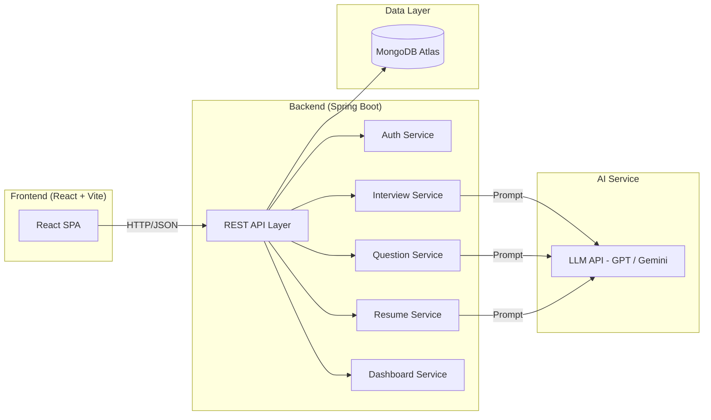

# Product Requirements Document (PRD)

## AI Interview Simulation System — Interview Copilot

| Field              | Detail                                      |
| ------------------ | ------------------------------------------- |
| **Product Name**   | Interview Copilot                           |
| **Version**        | 1.0 (MVP)                                   |
| **Author**         | Interview Copilot Team                      |
| **Date**           | August 25, 2026                             |
| **Status**         | Approved                                    |
| **Tech Stack**     | React/Vite · Java Spring Boot · MongoDB Atlas · AI Service (LLM) |

---

## 1. Problem Statement

### 1.1 The Problem

Preparing for job interviews — especially technical and HR rounds — is a fragmented, stressful, and largely unguided experience for students and early-career professionals.

| Pain Point | Detail |
|---|---|
| **Scattered Resources** | Candidates juggle multiple platforms (LeetCode for DSA, YouTube for HR tips, Google Docs for resumes) with no unified workflow. |
| **No Realistic Practice** | Reading questions is not the same as answering them under interview conditions. Most candidates never experience a simulated interview before the real one. |
| **Zero Personalized Feedback** | Friends and peers can offer subjective opinions, but no one provides structured, data-driven evaluation of technical accuracy, communication clarity, and answer quality. |
| **Blind Spots Go Unnoticed** | Without systematic tracking, candidates keep practising topics they already know and ignore weak areas that cost them offers. |
| **Resume Disconnect** | Candidates don't know how well their resume aligns with the roles they target, and traditional resume reviews are expensive or inaccessible. |

### 1.2 Opportunity

A single AI-powered platform that combines question practice, mock interviews, resume analysis, and performance tracking can eliminate context-switching, deliver objective feedback, and significantly improve interview outcomes — all at zero or low cost.

---

## 2. Target Users

### 2.1 Primary Personas

| Persona | Description | Key Needs |
|---|---|---|
| **College Student (CS/IT)** | 3rd–4th year undergraduate preparing for campus placements. Limited interview experience. | Structured DSA practice, mock interview exposure, confidence building. |
| **Fresh Graduate** | 0–1 year post-graduation, actively applying to entry-level software roles. | Role-specific preparation, resume feedback, realistic interview simulation. |
| **Career Switcher** | Professional transitioning into tech from a non-tech background. | Guided learning path, HR interview practice, resume alignment with new domain. |

### 2.2 Secondary Persona

| Persona | Description | Key Needs |
|---|---|---|
| **Early-Career Professional** | 1–3 years of experience, targeting a specific company or higher role. | Company-specific question banks, advanced technical practice, performance benchmarking. |

### 2.3 User Characteristics

- Age range: 18–30.
- Comfortable with web applications and basic English communication.
- Motivated but often lack structured guidance and objective self-assessment.
- Price-sensitive; free or freemium models preferred.

---

## 3. Product Goals

### 3.1 Business Goals

| # | Goal | Success Indicator |
|---|---|---|
| G1 | Establish a unified interview preparation platform for the MVP target segment. | ≥ 500 registered users within 3 months of launch. |
| G2 | Demonstrate measurable user improvement through AI-driven feedback. | ≥ 60% of active users show score improvement over 4+ sessions. |
| G3 | Validate the core AI feedback loop before expanding features. | Positive qualitative feedback (≥ 4/5 avg.) on AI evaluation accuracy. |

### 3.2 User Goals

| # | Goal |
|---|---|
| U1 | Practice technical (DSA, CS fundamentals) and HR questions in one place. |
| U2 | Experience realistic AI-powered mock interviews with structured feedback. |
| U3 | Understand personal strengths and weaknesses with clear, actionable insights. |
| U4 | Get resume feedback aligned to their target role. |
| U5 | Track progress over time and know when they are "interview-ready." |

---

## 4. Core Features (MVP Scope)

### 4.1 Feature Map

```
Interview Copilot MVP
├── F1  User Authentication & Profile
├── F2  Role / Company Selection
├── F3  Question Practice Mode
├── F4  AI Mock Interview
├── F5  AI Evaluation & Feedback
├── F6  Resume Upload & Analysis
├── F7  Dashboard & Progress Tracking
└── F8  Improvement Recommendations
```

---

### F1 — User Authentication & Profile

**Description:** Users can sign up, log in, and build a profile that drives personalization across the platform.

| Aspect | Detail |
|---|---|
| Sign-up / Login | Email + password registration; OAuth 2.0 (Google) login. |
| Profile Fields | Name, email, education level, years of experience, target role, skills list, preferred language (for coding). |
| Session Management | JWT-based authentication with refresh tokens. |

**Acceptance Criteria:**
- [ ] A new user can register with email/password or Google OAuth and lands on the dashboard.
- [ ] Profile data is persisted and editable from a settings page.
- [ ] Invalid or duplicate registrations return clear error messages.
- [ ] Sessions expire after 24 hours of inactivity; refresh tokens extend active sessions silently.

---

### F2 — Role / Company Selection

**Description:** Users select a target role (e.g., "Backend Developer," "Data Analyst") and optionally a target company. This selection drives question filtering and interview simulation context.

| Aspect | Detail |
|---|---|
| Role Catalog | Pre-defined list of 10–15 common tech roles (expandable post-MVP). |
| Company Selection | Optional free-text field; used as context for AI-generated questions. |
| Persistence | Stored on user profile; changeable at any time. |

**Acceptance Criteria:**
- [ ] User can select a role from a dropdown and optionally enter a company name.
- [ ] Selected role/company is reflected in question recommendations and mock interview prompts.
- [ ] Changing the role updates subsequent recommendations without losing past history.

---

### F3 — Question Practice Mode

**Description:** A self-paced practice environment where users browse and attempt technical and HR questions categorized by topic and difficulty.

| Aspect | Detail |
|---|---|
| Question Types | DSA (arrays, strings, trees, graphs, DP, etc.), CS fundamentals (OS, DBMS, CN, OOP), HR / behavioral. |
| Difficulty Levels | Easy, Medium, Hard. |
| Answer Input | Text-area for code/pseudocode (technical) or free-text (HR/behavioral). |
| AI Evaluation | On submission, AI evaluates the answer and returns a score (1–10) with written feedback covering correctness, approach quality, edge-case coverage (technical) or clarity, structure, relevance (HR). |

**Acceptance Criteria:**
- [ ] Questions are filterable by type, topic, and difficulty.
- [ ] User can type and submit an answer; submission triggers AI evaluation within 10 seconds.
- [ ] Feedback includes a numeric score and at least 3 specific comments (strengths, weaknesses, suggestions).
- [ ] Attempted questions are marked in the user's history.

---

### F4 — AI Mock Interview

**Description:** A time-bound, conversational interview simulation powered by AI that mimics a real interview experience.

| Aspect | Detail |
|---|---|
| Interview Setup | User selects interview type (Technical / HR / Mixed), duration (15 / 30 min), and role context. |
| Question Flow | AI presents one question at a time; follow-up questions adapt based on the user's previous answer. |
| Interaction Mode | Text-based Q&A (voice support is out of scope for MVP). |
| Timer | Visible countdown timer; auto-submits at expiry. |
| Session Artifacts | Full transcript saved for review. |

**Acceptance Criteria:**
- [ ] User can configure and start a mock interview with selected parameters.
- [ ] AI delivers 4–8 questions in a 30-minute session, adapting to user responses.
- [ ] A running timer is visible; session auto-ends when time expires.
- [ ] Full Q&A transcript is saved and accessible from the dashboard.

---

### F5 — AI Evaluation & Feedback

**Description:** After a mock interview or practice session, the AI produces a structured evaluation report.

| Aspect | Detail |
|---|---|
| Evaluation Dimensions | Technical Accuracy, Problem-Solving Approach, Communication Clarity, Answer Completeness, Confidence (textual proxy). |
| Output Format | Overall score (0–100), dimension-wise scores, written strengths, written weaknesses, actionable next steps. |
| Comparison | Session score compared against the user's own historical average (no peer benchmarking in MVP). |

**Acceptance Criteria:**
- [ ] A feedback report is generated within 15 seconds of session completion.
- [ ] Report contains an overall score and at least 4 dimension-wise sub-scores.
- [ ] Strengths and weaknesses sections each contain ≥ 2 specific, non-generic observations.
- [ ] The report is permanently stored and viewable from interview history.

---

### F6 — Resume Upload & Analysis

**Description:** Users upload their resume (PDF) and receive AI-powered analysis and suggestions.

| Aspect | Detail |
|---|---|
| Upload | PDF only, max 5 MB. |
| Analysis Output | Role alignment score (how well the resume matches the target role), section-by-section feedback (summary, experience, skills, projects, education), keyword gap analysis, top 5 actionable improvement suggestions. |
| Storage | Latest uploaded resume stored per user. |

**Acceptance Criteria:**
- [ ] User can upload a PDF resume; non-PDF files are rejected with a clear message.
- [ ] Analysis report is generated within 20 seconds.
- [ ] Report includes a role-alignment score and ≥ 5 specific suggestions.
- [ ] User can re-upload a new resume; previous analysis is archived.

---

### F7 — Dashboard & Progress Tracking

**Description:** A personalized dashboard that provides at-a-glance insight into the user's preparation journey.

| Aspect | Detail |
|---|---|
| Summary Cards | Total sessions, average score, questions attempted, current streak. |
| Score Trend | Line chart showing session scores over time. |
| Topic Heatmap | Visual indicator (strong / moderate / weak) per topic area based on performance. |
| Interview History | Paginated list of past sessions with date, type, score, and link to full report. |
| Readiness Indicator | Simple gauge (Not Ready / Getting There / Interview Ready) computed from recent scores and coverage. |

**Acceptance Criteria:**
- [ ] Dashboard loads within 3 seconds and displays accurate aggregate statistics.
- [ ] Score trend chart updates after every new session.
- [ ] Topic heatmap reflects actual performance data (not static).
- [ ] Interview readiness indicator recalculates after each session.

---

### F8 — Improvement Recommendations

**Description:** AI-driven suggestions that tell the user *what to practice next* based on performance data.

| Aspect | Detail |
|---|---|
| Weak-Area Identification | Topics where the user scored below threshold (< 50%) are flagged. |
| Recommended Actions | Specific practice questions, suggested mock interview focus areas, or resume edits. |
| Delivery | Shown on the dashboard and optionally after each session report. |

**Acceptance Criteria:**
- [ ] After ≥ 3 sessions, the system surfaces at least 3 personalized recommendations.
- [ ] Recommendations update as the user completes more sessions.
- [ ] Each recommendation links to a relevant practice question or action.

---

## 5. Success Metrics

### 5.1 North Star Metric

> **Percentage of active users who show measurable score improvement over 4+ sessions.**

### 5.2 Supporting Metrics

| Category | Metric | Target (3 months) |
|---|---|---|
| **Acquisition** | Total registered users | ≥ 500 |
| **Activation** | Users who complete at least 1 mock interview | ≥ 60% of registered |
| **Engagement** | Avg. sessions per active user per week | ≥ 2 |
| **Retention** | Week-4 retention rate | ≥ 30% |
| **Outcome** | Users showing score improvement (4+ sessions) | ≥ 60% |
| **Satisfaction** | Average feedback rating on AI evaluation quality | ≥ 4.0 / 5.0 |
| **Performance** | AI evaluation response time (p95) | ≤ 15 seconds |

---

## 6. Technical Architecture Overview



| Layer | Technology | Responsibility |
|---|---|---|
| **Frontend** | React 18 + Vite + Tailwind CSS | SPA rendering, routing, state management, API consumption. |
| **Backend** | Java 17+ / Spring Boot 3.x | REST APIs, business logic, auth, data access, AI orchestration. |
| **Database** | MongoDB Atlas | User profiles, questions, sessions, transcripts, scores, resumes. |
| **AI Service** | OpenAI / Google Gemini API | Question generation, answer evaluation, resume analysis, recommendations. |
| **Auth** | Spring Security + JWT + OAuth 2.0 | Authentication, authorization, session management. |

---

## 7. Assumptions

| # | Assumption |
|---|---|
| A1 | Users have a stable internet connection and use a modern browser (Chrome, Firefox, Edge, Safari). |
| A2 | Text-based interaction is sufficient for MVP; voice/video is not required for initial validation. |
| A3 | A third-party LLM API (OpenAI GPT or Google Gemini) will be used; no custom model training is needed for MVP. |
| A4 | MongoDB Atlas free/shared tier is sufficient for MVP-scale data (< 5 GB). |
| A5 | The question bank will be seeded with ≥ 200 curated questions at launch; AI will supplement dynamically. |
| A6 | AI evaluation quality is "good enough" for preparation purposes; it does not need to match human-interviewer accuracy. |
| A7 | Users will primarily use the platform in English. |
| A8 | PDF is the dominant resume format among the target audience. |

---

## 8. Risks & Mitigations

| # | Risk | Likelihood | Impact | Mitigation |
|---|---|---|---|---|
| R1 | **AI evaluation inaccuracy** — LLM produces incorrect or generic feedback. | Medium | High | Constrain prompts with rubrics and few-shot examples; allow users to flag bad feedback; iterate on prompts post-launch. |
| R2 | **LLM API cost overrun** — High token usage drives unexpected costs. | Medium | Medium | Set per-user daily session limits (e.g., 5 sessions/day); cache common question evaluations; monitor usage dashboards. |
| R3 | **LLM API downtime or latency** — Third-party outage blocks core functionality. | Low | High | Implement retry logic with exponential backoff; show graceful degradation (allow practice without AI eval); consider a secondary LLM provider. |
| R4 | **Low user engagement** — Users sign up but don't return. | Medium | High | Gamification-lite (streaks, readiness gauge); email nudges; focus on fast time-to-value (first mock interview < 2 min from signup). |
| R5 | **Question quality** — Seeded questions are outdated or irrelevant. | Low | Medium | Source questions from well-known public repositories; tag with last-verified date; allow community reporting post-MVP. |
| R6 | **Data privacy concerns** — Users upload resumes containing PII. | Medium | High | Encrypt data at rest and in transit; clear data-retention policy; do not share resume data with third parties beyond the LLM API; provide delete-account functionality. |
| R7 | **Scope creep** — Pressure to add voice, video, or collaborative features before validating core loop. | High | Medium | Enforce the out-of-scope list below; tie every feature request to a validated user need. |

---

## 9. Out-of-Scope Features (Post-MVP)

> [!IMPORTANT]
> The following features are explicitly **excluded from the MVP** to keep the release focused and deliverable. They are candidates for future iterations.

| Feature | Reason for Exclusion |
|---|---|
| **Voice / Video Interviews** | Adds significant complexity (WebRTC, speech-to-text); text-based is sufficient to validate the core feedback loop. |
| **Live Coding Editor (IDE)** | Requires sandboxed code execution, test-case evaluation, and language support; pseudocode/text input is adequate for MVP. |
| **Peer / Community Features** | Social features (forums, peer reviews, leaderboards) are engagement boosters but not core to the value proposition. |
| **Admin Panel / CMS** | Questions and content will be managed via scripts/DB seeding; a full admin UI is premature. |
| **Payment / Subscription System** | MVP will be free; monetization strategy validated after user adoption. |
| **Mobile Application (Native)** | Responsive web app covers mobile use cases for MVP. |
| **Multi-Language Support (i18n)** | English-only for MVP; localization is a growth-phase feature. |
| **Company-Specific Question Banks** | AI-generated company context is included, but curated company-specific banks require partnerships or scraping. |
| **Interview Scheduling with Mentors** | Human mentor matching is a different product vertical. |
| **Plagiarism / Cheating Detection** | Not applicable to a self-practice tool. |

---

## 10. Acceptance Criteria Summary

> [!NOTE]
> Each feature's detailed acceptance criteria are listed in Section 4. Below is the system-level acceptance criteria for MVP release readiness.

| # | Criterion |
|---|---|
| AC1 | A new user can register, complete their profile, and start a mock interview within 3 minutes. |
| AC2 | The system supports at least 200 seeded questions across ≥ 5 technical topics and HR/behavioral. |
| AC3 | AI mock interview generates adaptive follow-up questions (not just random selection). |
| AC4 | AI feedback reports contain dimension-wise scores and specific, actionable commentary. |
| AC5 | Resume upload accepts PDF files and returns analysis within 20 seconds. |
| AC6 | Dashboard accurately reflects all historical sessions, scores, and trends. |
| AC7 | Improvement recommendations are personalized (based on actual user data, not static). |
| AC8 | All API endpoints respond within 3 seconds (excluding AI processing, which is ≤ 15 seconds p95). |
| AC9 | User data is encrypted at rest (MongoDB Atlas encryption) and in transit (HTTPS/TLS). |
| AC10 | The application is deployable to a cloud environment (e.g., Railway, Render, AWS) with CI/CD pipeline. |

---

## 11. Release Milestones (Suggested)

| Milestone | Scope | Target |
|---|---|---|
| **M0 — Foundation** | Project setup, auth, user profile, DB schema, CI/CD. | Week 1–2 |
| **M1 — Practice Mode** | Question bank seeding, practice mode UI, AI evaluation integration. | Week 3–4 |
| **M2 — Mock Interview** | Interview session flow, adaptive questioning, transcript storage. | Week 5–6 |
| **M3 — Resume & Feedback** | Resume upload + analysis, evaluation reports, recommendation engine. | Week 7–8 |
| **M4 — Dashboard & Polish** | Dashboard, progress tracking, readiness indicator, bug fixes, UX polish. | Week 9–10 |
| **M5 — Beta Launch** | Internal testing, user acceptance testing, soft launch. | Week 11–12 |

---

## 12. Appendix

### 12.1 Glossary

| Term | Definition |
|---|---|
| **DSA** | Data Structures and Algorithms. |
| **Mock Interview** | A simulated interview session conducted by the AI. |
| **Session** | A single practice or mock interview attempt. |
| **Readiness Indicator** | A computed gauge reflecting the user's preparedness based on scores and topic coverage. |
| **Role Alignment Score** | A metric indicating how well a resume matches the requirements of the user's target role. |

### 12.2 Data Model — Key Collections (MongoDB)

| Collection | Key Fields |
|---|---|
| `users` | `_id`, `email`, `passwordHash`, `name`, `education`, `experience`, `targetRole`, `targetCompany`, `skills`, `createdAt` |
| `questions` | `_id`, `type` (technical/hr), `topic`, `difficulty`, `text`, `hints`, `sampleAnswer`, `tags` |
| `sessions` | `_id`, `userId`, `type` (practice/mock), `interviewType`, `startedAt`, `endedAt`, `transcript[]`, `overallScore`, `dimensionScores{}` |
| `evaluations` | `_id`, `sessionId`, `questionId`, `userAnswer`, `score`, `feedback{}`, `strengths[]`, `weaknesses[]` |
| `resumes` | `_id`, `userId`, `fileUrl`, `analysisResult{}`, `roleAlignmentScore`, `uploadedAt` |
| `recommendations` | `_id`, `userId`, `generatedAt`, `items[]` (topic, action, linkedQuestionId) |

---

*This document is a living artifact. It will be updated as user feedback and technical discoveries emerge during development.*

