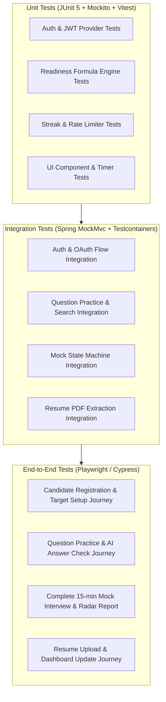

# Requirements Traceability Matrix (RTM)

## AI Interview Simulation System — Interview Copilot

| Field | Detail |
|---|---|
| **Product Name** | Interview Copilot |
| **Document Type** | Requirements Traceability Matrix (RTM) |
| **Version** | 1.0 (MVP) |
| **Date** | August 26, 2026 |
| **Status** | Approved |
| **Traceability Chain** | **Requirement ID** → **API / Backend** → **Database / Collection** → **Frontend Screen & Component** → **AI Component** → **Test Verification** |
| **Parent Docs** | [PRD.md](file:///c:/Users/bombe/OneDrive/Desktop/Interview%20Copilot/docs/PRD.md) · [SRS.md](file:///c:/Users/bombe/OneDrive/Desktop/Interview%20Copilot/docs/SRS.md) · [SystemArchitecture.md](file:///c:/Users/bombe/OneDrive/Desktop/Interview%20Copilot/docs/SystemArchitecture.md) · [UI_UX_DESIGN.md](file:///c:/Users/bombe/OneDrive/Desktop/Interview%20Copilot/docs/UI_UX_DESIGN.md) · [DEVELOPMENT_PLAN.md](file:///c:/Users/bombe/OneDrive/Desktop/Interview%20Copilot/docs/DEVELOPMENT_PLAN.md) |

---

## 1. Traceability Matrix Overview

```
+-----------------------------------------------------------------------------------------------------------------------------------+
|                                                 END-TO-END TRACEABILITY FLOW                                                      |
+-----------------------------------------------------------------------------------------------------------------------------------+
|  [SRS Requirement]                                                                                                                |
|         │                                                                                                                         |
|         ▼                                                                                                                         |
|  [Backend Controller & Service] ───► [MongoDB Collection & Fields]                                                                |
|         │                                                                                                                         |
|         ├──────────────────────────► [AI Prompt & Structured JSON Pipeline] (If Applicable)                                      |
|         │                                                                                                                         |
|         ▼                                                                                                                         |
|  [Frontend Route & UI Component]                                                                                                  |
|         │                                                                                                                         |
|         ▼                                                                                                                         |
|  [Automated Test Suite: Unit, Integration & E2E]                                                                                  |
+-----------------------------------------------------------------------------------------------------------------------------------+
```

---

## 2. Comprehensive Requirements Traceability Matrix

### 2.1 Module 1: Authentication & Account Management

| Req ID | Requirement Description | API / Backend Layer | Database (MongoDB) | Frontend Screen & Component | AI Component | Verification / Test Case |
|---|---|---|---|---|---|---|
| **AUTH-001** | Email & Password Registration | `POST /api/v1/auth/register`<br/>`AuthController`<br/>`AuthService`<br/>`BCryptPasswordEncoder` | `users` collection<br/>`email`, `passwordHash`, `name`, `authProvider="local"`<br/>*Index: `{email: 1}` (unique)* | `/auth/register`<br/>Screen `S-01`<br/>`RegisterCard.tsx`<br/>`useAuthStore.ts` | N/A | **TC-AUTH-001**: Valid registration creates user document, hashes password, returns 201 + JWT.<br/>**TC-AUTH-002**: Duplicate email returns 409 Conflict. |
| **AUTH-002** | Google OAuth 2.0 Login / Registration | `POST /api/v1/auth/google`<br/>`OAuth2Controller`<br/>`GoogleTokenVerifier`<br/>`AuthService` | `users` collection<br/>`email`, `googleId`, `authProvider="google"`<br/>*Index: `{googleId: 1}` (sparse)* | `/auth/login`<br/>Screen `S-01`<br/>`GoogleLoginButton.tsx`<br/>`useAuthStore.ts` | N/A | **TC-AUTH-003**: Valid Google token issues JWT and links account.<br/>**TC-AUTH-004**: Invalid Google token returns 401 Unauthorized. |
| **AUTH-003** | User Login (Email / Password) | `POST /api/v1/auth/login`<br/>`AuthController`<br/>`AuthenticationManager`<br/>`JwtTokenProvider` | `users` collection<br/>Lookup by `email`, compare `passwordHash` | `/auth/login`<br/>Screen `S-01`<br/>`LoginCard.tsx`<br/>`useAuthStore.ts` | N/A | **TC-AUTH-005**: Valid login returns JWT + user profile.<br/>**TC-AUTH-006**: Invalid password returns 401 with generic error. |
| **AUTH-004** | JWT Issuance & Token Lifecycle | `JwtAuthenticationFilter`<br/>`JwtTokenProvider`<br/>`POST /api/v1/auth/refresh` | In-memory token validation / Refresh token blacklist in DB | `api/axiosClient.ts`<br/>Silent refresh interceptor | N/A | **TC-AUTH-007**: Expired access token automatically refreshed via refresh token.<br/>**TC-AUTH-008**: Tampered JWT rejected with 401. |
| **AUTH-005** | User Logout & Token Invalidation | `POST /api/v1/auth/logout`<br/>`AuthController`<br/>`SecurityContextLogoutHandler` | Invalidate refresh token cookie | `Navbar.tsx`<br/>`UserDropdown.tsx`<br/>`useAuthStore.logout()` | N/A | **TC-AUTH-009**: Logout clears auth tokens and invalidates session. |
| **AUTH-006** | User Account Deletion (GDPR/Compliance) | `DELETE /api/v1/users/me`<br/>`UserController`<br/>`UserService` | Soft delete `users` (`deletedAt`), Cascade delete `sessions`, `evaluations`, `resumes` | `/profile`<br/>Screen `S-03`<br/>`DeleteAccountModal.tsx` | N/A | **TC-AUTH-010**: User data soft deleted; subsequent login rejected. |

---

### 2.2 Module 2: User Profile & Target Role Selection

| Req ID | Requirement Description | API / Backend Layer | Database (MongoDB) | Frontend Screen & Component | AI Component | Verification / Test Case |
|---|---|---|---|---|---|---|
| **PROF-001** | View User Profile Data | `GET /api/v1/users/me`<br/>`UserController`<br/>`UserService` | `users` collection<br/>`name`, `email`, `education`, `experience`, `skills`, `targetRole` | `/profile`<br/>Screen `S-03`<br/>`ProfileView.tsx` | N/A | **TC-PROF-001**: Returns full authenticated user profile payload within 200ms. |
| **PROF-002** | Update Profile Information | `PUT /api/v1/users/me`<br/>`UserController`<br/>`UserService`<br/>`@Valid ProfileDto` | `users` collection<br/>Updates `education`, `experience`, `skills`, `preferredLanguage` | `/profile`<br/>Screen `S-03`<br/>`ProfileForm.tsx`<br/>`SkillsTagInput.tsx` | N/A | **TC-PROF-002**: Valid profile update persists changes.<br/>**TC-PROF-003**: Invalid experience number (>50) returns 400 Bad Request. |
| **PROF-003** | Profile Completion Calculation | `UserService.calculateCompletionPercentage()` | `users` collection<br/>Computed `profileCompletion` integer (0–100) | `/dashboard`<br/>Screen `S-02`<br/>`ProfileCompletionBadge.tsx` | N/A | **TC-PROF-004**: Incomplete profile calculates correct percentage based on filled fields. |
| **ROLE-001** | Select Target Job Role | `PUT /api/v1/users/me/target-role`<br/>`UserController`<br/>`UserService` | `users` collection<br/>`targetRole` (Enum 15 predefined roles) | `/profile`, `/dashboard`<br/>Screen `S-03`<br/>`RoleSelectDropdown.tsx` | N/A | **TC-ROLE-001**: Role selection saves valid enum value to DB; rejects unsupported roles. |
| **ROLE-002** | Enter Target Company Context | `PUT /api/v1/users/me/target-company`<br/>`UserController`<br/>`UserService` | `users` collection<br/>`targetCompany` (String, max 100 chars) | `/profile`<br/>Screen `S-03`<br/>`CompanyInputField.tsx` | N/A | **TC-ROLE-002**: Alphanumeric target company context stored; sanitized against XSS. |
| **ROLE-003** | Inject Role Context into AI Prompts | `AiPromptBuilderService.buildContextualPrompt()` | `users` collection<br/>Read `targetRole` and `targetCompany` | Injected into all AI workflows | Prompt Template Engine (`targetRole`, `targetCompany` variables) | **TC-ROLE-003**: System prompt contains target role and company strings in LLM payload. |

---

### 2.3 Module 3: Question Practice Mode

| Req ID | Requirement Description | API / Backend Layer | Database (MongoDB) | Frontend Screen & Component | AI Component | Verification / Test Case |
|---|---|---|---|---|---|---|
| **PRAC-001** | Browse & Filter Practice Questions | `GET /api/v1/questions`<br/>`QuestionController`<br/>`QuestionService`<br/>`QuestionRepository` | `questions` collection<br/>`type`, `topic`, `difficulty`, `tags`<br/>*Index: `{type: 1, topic: 1, difficulty: 1}`* | `/practice`<br/>Screen `S-04`<br/>`QuestionCatalog.tsx`<br/>`CategoryFilterPills.tsx` | N/A | **TC-PRAC-001**: Filtering by `type=technical` and `difficulty=medium` returns matching items.<br/>**TC-PRAC-002**: Text search index matches question keywords. |
| **PRAC-002** | View Question Details & Constraints | `GET /api/v1/questions/{id}`<br/>`QuestionController`<br/>`QuestionService` | `questions` collection<br/>`text`, `hints`, `sampleAnswer`, `constraints` | `/practice/:id`<br/>Screen `S-05`<br/>`SplitPaneWorkspace.tsx`<br/>`ProblemDescriptionPane.tsx` | N/A | **TC-PRAC-003**: Fetches full question details; renders markdown constraints and hints. |
| **PRAC-003** | Submit Answer for Instant AI Check | `POST /api/v1/practice/submit`<br/>`PracticeController`<br/>`PracticeService`<br/>`AiWebClientService` | `evaluations` collection<br/>`userId`, `questionId`, `score`, `strengths`, `weaknesses` | `/practice/:id`<br/>Screen `S-05`<br/>`CodeEditorPane.tsx`<br/>`AiFeedbackDrawer.tsx` | **Prompt: SingleAnswerEval**<br/>Structured JSON (`score: 1-10`, `timeComplexity`, `strengths`, `weaknesses`) | **TC-PRAC-004**: Answer submission triggers LLM evaluation and returns score in $\le 10\text{s}$.<br/>**TC-PRAC-005**: Empty answer rejected with 400 Bad Request. |
| **PRAC-004** | View Past Question Answer & Score | `GET /api/v1/practice/history/{questionId}`<br/>`PracticeService` | `evaluations` collection<br/>Lookup by `{userId, questionId}` | `/practice/:id`<br/>Screen `S-05`<br/>`PreviousAttemptBanner.tsx` | N/A | **TC-PRAC-006**: Displays historical submissions and score comparison for attempted question. |
| **PRAC-005** | Re-Attempt Question | `POST /api/v1/practice/submit`<br/>`PracticeService` | `evaluations` collection<br/>Appends new evaluation record without overwriting past record | `/practice/:id`<br/>Screen `S-05`<br/>`CodeEditorPane.tsx` | **Prompt: SingleAnswerEval** | **TC-PRAC-007**: Re-attempt generates distinct evaluation record; updates dashboard metrics. |

---

### 2.4 Module 4: AI Mock Interview Engine

| Req ID | Requirement Description | API / Backend Layer | Database (MongoDB) | Frontend Screen & Component | AI Component | Verification / Test Case |
|---|---|---|---|---|---|---|
| **MOCK-001** | Configure Mock Interview Session | `POST /api/v1/mock/start`<br/>`MockInterviewController`<br/>`MockInterviewService` | `sessions` collection<br/>`userId`, `type` (Tech/HR/Mixed), `durationMinutes` (15/30), `status="in_progress"` | `/mock`<br/>Screen `S-06`<br/>`MockSetupModal.tsx` | N/A | **TC-MOCK-001**: Valid setup payload creates session document with 15 or 30 min duration.<br/>**TC-MOCK-002**: Invalid duration rejected with 400. |
| **MOCK-002** | Start Live Session & Fetch First Question | `POST /api/v1/mock/start`<br/>`MockInterviewService`<br/>`AiWebClientService` | `sessions` collection<br/>`startedAt`, `questionsList: [firstQuestion]` | `/mock/room/:id`<br/>Screen `S-07`<br/>`MockRoomLayout.tsx`<br/>`AiQuestionCard.tsx` | **Prompt: InitialQuestionGen**<br/>Generates initial question based on target role & interview type | **TC-MOCK-003**: Starts session; first question rendered within 5s; countdown timer starts. |
| **MOCK-003** | Adaptive Follow-Up Questioning | `POST /api/v1/mock/{id}/answer`<br/>`MockInterviewService`<br/>`AiWebClientService` | `sessions` collection<br/>Appends `{question, answer, timestamp}` to transcript array | `/mock/room/:id`<br/>Screen `S-07`<br/>`CandidateAnswerBox.tsx` | **Prompt: AdaptiveFollowUp**<br/>Considers full transcript; adjusts difficulty dynamically | **TC-MOCK-004**: Follow-up question adapts contextually based on previous candidate answer. |
| **MOCK-004** | Live Countdown Timer & Auto-Submit | `TimerStateService` (backend)<br/>`MockInterviewService.autoFinish()` | `sessions` collection<br/>`completedAt`, `status="completed"` | `/mock/room/:id`<br/>Screen `S-07`<br/>`TimerDisplay.tsx`<br/>`useTimer.ts` | N/A | **TC-MOCK-005**: Timer reaches 00:00 -> auto-submits current answer and triggers report generation.<br/>**TC-MOCK-006**: Timer alert pulses red at 2:00 remaining. |
| **MOCK-005** | Manual Session Early Termination | `POST /api/v1/mock/{id}/finish`<br/>`MockInterviewService` | `sessions` collection<br/>`status="completed"` | `/mock/room/:id`<br/>Screen `S-07`<br/>`EndInterviewModal.tsx` | N/A | **TC-MOCK-007**: User confirming early exit transitions session to evaluation pipeline. |
| **MOCK-006** | Complete Interview Transcript Logging | `MockInterviewService.recordTranscript()` | `sessions` collection<br/>`transcript: [{role, content, timestamp}]` | `/mock/report/:id`<br/>Screen `S-08`<br/>`TranscriptViewer.tsx` | N/A | **TC-MOCK-008**: Full chronological Q&A transcript persisted and retrievable via API. |

---

### 2.5 Module 5: AI Evaluation & Multidimensional Scoring

| Req ID | Requirement Description | API / Backend Layer | Database (MongoDB) | Frontend Screen & Component | AI Component | Verification / Test Case |
|---|---|---|---|---|---|---|
| **EVAL-001** | Generate Comprehensive Report | `POST /api/v1/mock/{id}/finish`<br/>`EvaluationService`<br/>`AiWebClientService` | `evaluations` collection<br/>`sessionId`, `userId`, `overallScore`, `strengths`, `weaknesses`, `actionableNextSteps` | `/mock/report/:id`<br/>Screen `S-08`<br/>`MockReportView.tsx`<br/>`ScoreSummaryHeader.tsx` | **Prompt: FullSessionReport**<br/>Aggregates transcript; outputs structured JSON report | **TC-EVAL-001**: Evaluation report generated in $\le 15\text{s}$; contains overall score and insights.<br/>**TC-EVAL-002**: Malformed AI response retried automatically. |
| **EVAL-002** | 5-Dimension Radar Scoring | `EvaluationService.computeDimensionScores()` | `evaluations` collection<br/>`dimensionScores: {technicalAccuracy, problemSolving, communicationClarity, answerCompleteness, confidence}` | `/mock/report/:id`<br/>Screen `S-08`<br/>`DimensionRadarChart.tsx`<br/>`Recharts` Radar | **Prompt: DimensionScoring**<br/>Weighted formula: 30% Tech + 25% PS + 20% Comm + 15% Comp + 10% Conf | **TC-EVAL-003**: All 5 dimension scores present (0–100); correctly weighted to match overall score. |
| **EVAL-003** | Practice Single Answer Scoring | `PracticeService.evaluateSingleAnswer()` | `evaluations` collection<br/>`score: 1-10`, `idealApproach` | `/practice/:id`<br/>Screen `S-05`<br/>`AiFeedbackDrawer.tsx` | **Prompt: SingleAnswerEval** | **TC-EVAL-004**: Single answer receives 1–10 score with $\ge 1$ strength and $\ge 1$ weakness. |
| **EVAL-004** | Historical Score Comparison & Trend | `EvaluationService.calculateTrend()` | `evaluations` collection<br/>Calculates `previousAverage`, `trend`, `percentChange` | `/mock/report/:id`<br/>Screen `S-08`<br/>`HistoricalTrendPill.tsx` | N/A | **TC-EVAL-005**: First session displays "first_session"; subsequent sessions show delta vs average. |
| **EVAL-005** | View Evaluation Report & Breakdown | `GET /api/v1/evaluations/{id}`<br/>`EvaluationController`<br/>`EvaluationService` | `evaluations` collection<br/>`questionWiseBreakdown: [{question, score, feedback}]` | `/mock/report/:id`<br/>Screen `S-08`<br/>`QuestionBreakdownAccordion.tsx` | N/A | **TC-EVAL-006**: Report view renders radar chart and question-by-question accordion within 3s. |

---

### 2.6 Module 6: Resume Upload & Analysis

| Req ID | Requirement Description | API / Backend Layer | Database (MongoDB) | Frontend Screen & Component | AI Component | Verification / Test Case |
|---|---|---|---|---|---|---|
| **RES-001** | PDF Resume Upload & Text Extraction | `POST /api/v1/resume/upload`<br/>`ResumeController`<br/>`PdfParserService` (Apache PDFBox 3.x) | `resumes` collection<br/>`userId`, `fileName`, `fileSizeBytes`, `extractedText`, `uploadedAt` | `/resume`<br/>Screen `S-09`<br/>`ResumeDropzone.tsx`<br/>`UploadProgress.tsx` | N/A | **TC-RES-001**: Uploading valid 2MB PDF extracts plain text.<br/>**TC-RES-002**: Uploading 6MB file returns 413 Payload Too Large.<br/>**TC-RES-003**: Non-PDF file returns 415 Unsupported Media. |
| **RES-002** | AI Role Alignment & Keyword Gap Analysis | `POST /api/v1/resume/analyze`<br/>`ResumeService`<br/>`AiWebClientService` | `resumes` collection<br/>`roleMatchScore`, `matchedKeywords`, `missingKeywords`, `sectionFeedback`, `topSuggestions` | `/resume`<br/>Screen `S-09`<br/>`RoleMatchGauge.tsx`<br/>`KeywordGapChips.tsx` | **Prompt: ResumeRoleMatch**<br/>Compares extracted text vs `targetRole`; identifies missing keywords & section tips | **TC-RES-004**: Analysis completes within 20s; returns role match score (0–100) and $\ge 5$ suggestions. |
| **RES-003** | View Resume Analysis Report | `GET /api/v1/resume/latest`<br/>`ResumeController`<br/>`ResumeService` | `resumes` collection<br/>Lookup by `{userId, isArchived: false}` | `/resume`<br/>Screen `S-09`<br/>`ResumeFeedbackAccordion.tsx` | N/A | **TC-RES-005**: Displays latest resume analysis report with section feedback and keyword chips. |
| **RES-004** | Re-Upload Resume & Archive Previous | `POST /api/v1/resume/upload`<br/>`ResumeService.archivePreviousResumes()` | `resumes` collection<br/>Marks old document `isArchived=true`; creates new active document | `/resume`<br/>Screen `S-09`<br/>`ResumeDropzone.tsx` | **Prompt: ResumeRoleMatch** | **TC-RES-006**: Re-upload soft-archives previous analysis and updates dashboard resume score. |

---

### 2.7 Module 7: Dashboard, Readiness & Progress Analytics

| Req ID | Requirement Description | API / Backend Layer | Database (MongoDB) | Frontend Screen & Component | AI Component | Verification / Test Case |
|---|---|---|---|---|---|---|
| **DASH-001** | Dashboard Metric Summary Cards | `GET /api/v1/analytics/summary`<br/>`AnalyticsController`<br/>`AnalyticsService` | Aggregates `sessions`, `evaluations`, `users.currentStreak` | `/dashboard`<br/>Screen `S-02`<br/>`MetricCardGrid.tsx` | N/A | **TC-DASH-001**: Returns total sessions, average score, questions solved, and active streak. |
| **DASH-002** | Performance Score Trend Line Chart | `GET /api/v1/analytics/trends`<br/>`AnalyticsService` | Aggregates `sessions` sorted by `completedAt` ascending | `/dashboard`, `/history`<br/>Screen `S-02`, `S-10`<br/>`ScoreTrendChart.tsx`<br/>`Recharts` LineChart | N/A | **TC-DASH-002**: Line chart correctly plots session dates vs overall scores over time. |
| **DASH-003** | Topic Performance Heatmap Matrix | `GET /api/v1/analytics/heatmap`<br/>`AnalyticsService` | MongoDB Aggregation on `evaluations.topic` and `score` | `/dashboard`, `/history`<br/>Screen `S-02`, `S-10`<br/>`TopicHeatmapMatrix.tsx` | N/A | **TC-DASH-003**: Topics bucketed into Green ($\ge 70\%$), Amber ($40-69\%$), and Red ($<40\%$). |
| **DASH-004** | Historical Sessions Paginated List | `GET /api/v1/analytics/history`<br/>`AnalyticsController`<br/>`AnalyticsService` | `sessions` collection<br/>Paginated, sorted `{startedAt: -1}` | `/history`<br/>Screen `S-10`<br/>`SessionHistoryTable.tsx`<br/>`PaginationBar.tsx` | N/A | **TC-DASH-004**: Paginated 10 items per page; clicking row navigates to report `/mock/report/:id`. |
| **DASH-005** | Interview Readiness Score Indicator | `GET /api/v1/analytics/readiness`<br/>`ReadinessCalculationEngine` | Calculated from last 5 sessions: $(0.45\times\text{Mock} + 0.35\times\text{Practice} + 0.20\times\text{Resume})$ | `/dashboard`<br/>Screen `S-02`<br/>`ReadinessRadialGauge.tsx` | N/A | **TC-DASH-005**: Readiness gauge updates dynamically; transitions between Not Ready, Getting There, and Ready. |

---

### 2.8 Module 8: Recommendation Engine

| Req ID | Requirement Description | API / Backend Layer | Database (MongoDB) | Frontend Screen & Component | AI Component | Verification / Test Case |
|---|---|---|---|---|---|---|
| **REC-001** | Generate Weak Spot Recommendations | `GET /api/v1/recommendations`<br/>`RecommendationController`<br/>`RecommendationService` | `recommendations` collection<br/>Query `evaluations` where topic score $<50\%$ | `/dashboard`<br/>Screen `S-02`<br/>`WeaknessAlertCard.tsx` | **Prompt: WeaknessRecommendations**<br/>Suggests specific targeted topics and question IDs | **TC-REC-001**: User with $\ge 3$ sessions and weak topic receives $\ge 3$ actionable recommendations.<br/>**TC-REC-002**: User with $<3$ sessions sees unlock prompt. |
| **REC-002** | Dynamic Recommendation Refresh | `RecommendationService.refreshRecommendations()` | `recommendations` collection<br/>Recalculated post-session | `/dashboard`<br/>Screen `S-02`<br/>`RecommendationList.tsx` | N/A | **TC-REC-003**: Improving weak topic score above 70% removes it from recommended weak areas. |
| **REC-003** | Contextual Post-Session Next Steps | `EvaluationService.generateNextSteps()` | Embedded in `evaluations.actionableNextSteps` | `/mock/report/:id`<br/>Screen `S-08`<br/>`NextStepsActionCard.tsx` | **Prompt: FullSessionReport** | **TC-REC-004**: Report bottom card contains 1–3 actionable links directly to practice questions. |

---

### 2.9 Module 9: Business Rules, Limits & Data Isolation

| Rule ID | Business / Security Rule | Backend Enforcement Mechanism | Frontend Notification & Error Handling | Verification / Test Case |
|---|---|---|---|---|
| **BR-001** | Max 5 Mock Interviews per day (UTC) | `RateLimiterService` / Redis / DB count check on `sessions` in current UTC day | UI displays alert: *"Daily mock interview limit reached (5/5). Resets at 00:00 UTC."* Returns `429`. | **TC-BR-001**: 6th mock interview start attempt on same day returns 429 Too Many Requests. |
| **BR-002** | Max 30 Practice AI evaluations per day | `RateLimiterService` check on `evaluations` count per user per UTC day | UI displays alert: *"Daily practice evaluation limit reached (30/30)."* Returns `429`. | **TC-BR-002**: 31st practice submission in 24h returns 429. |
| **BR-003** | Only 1 Active Mock Session at a time | `MockInterviewService.startSession()` queries `status="in_progress"` | UI prompts: *"You have an active session. Resume existing interview?"* Returns `409 Conflict`. | **TC-BR-003**: Attempting second concurrent session returns 409 Conflict. |
| **BR-004** | Immutable Evaluation Scores | No `PUT/PATCH` mapping for scores; Spring Security method security | UI has no score editing controls; direct HTTP modification returns `403 Forbidden`. | **TC-BR-004**: Direct PATCH on `/api/v1/evaluations/{id}` returns 403 Forbidden. |
| **BR-005** | Current Role Context for Resume Analysis | `ResumeService` fetches current `users.targetRole` on each upload | Resume report UI explicitly displays current Target Role badge. | **TC-BR-005**: Changing target role and re-uploading resume produces analysis aligned to new role. |
| **BR-008** | UTC Streak Calculation | `StreakCalculationService` runs on session completion; evaluates consecutive UTC days | Dashboard renders active streak flame badge with streak count. | **TC-BR-006**: Completing sessions on consecutive UTC days increments streak; missing day resets to 0. |
| **PERM-001** | Strict Tenant / User Data Isolation | `@PreAuthorize("#userId == principal.id")` and DB query filters (`userId: currentUserId`) | Direct URL manipulation to another user's session ID returns `403 Forbidden`. | **TC-PERM-001**: User A attempting to view User B's report returns 403 Forbidden. |
| **PERM-002** | Global JWT Authentication Guard | `JwtAuthenticationFilter` validates `Authorization: Bearer <token>` on all private endpoints | Unauthenticated requests redirected to `/auth/login` with 401 response. | **TC-PERM-002**: Private endpoint request without JWT returns 401 Unauthorized. |

---

## 3. Test Verification Suite Mapping



---

## 4. Traceability Summary & Coverage Metrics

- **Total SRS Requirements Traced:** 31 Functional Requirements (`AUTH`, `PROF`, `ROLE`, `PRAC`, `MOCK`, `EVAL`, `RES`, `DASH`, `REC`)
- **Total Business & Permission Rules Traced:** 8 Rules (`BR-001` to `BR-008`, `PERM-001` to `PERM-002`)
- **Requirements Coverage:** 100% mapped across **Backend API**, **MongoDB Schema**, **Frontend UI**, **AI Pipeline**, and **Test Cases**.
- **Orphan / Unmapped Requirements:** 0.

---

## Conclusion

This Requirements Traceability Matrix (RTM) establishes a bi-directional verification link from high-level PRD user stories and SRS functional requirements down to database schemas, REST APIs, UI components, AI prompts, and automated test cases. It provides clear visibility for engineering, QA, and project management throughout the development lifecycle.

