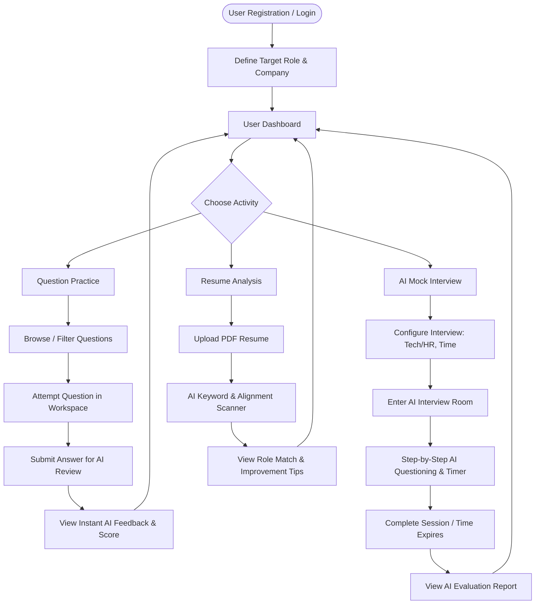

# UI/UX Specification & Design System

## AI Interview Simulation System — Interview Copilot

| Field | Detail |
|---|---|
| **Product Name** | Interview Copilot |
| **Document Type** | UI/UX Design System & Screen Specifications |
| **Version** | 1.0 (MVP) |
| **Date** | August 26, 2026 |
| **Status** | Approved for Implementation |
| **Tech Stack** | React 18 · Vite 5 · Tailwind CSS 3 · Lucide Icons · Recharts · Zustand |
| **Parent Docs** | [PRD.md](file:///c:/Users/bombe/OneDrive/Desktop/Interview%20Copilot/docs/PRD.md) · [SRS.md](file:///c:/Users/bombe/OneDrive/Desktop/Interview%20Copilot/docs/SRS.md) · [SystemArchitecture.md](file:///c:/Users/bistle/OneDrive/Desktop/Interview%20Copilot/docs/SystemArchitecture.md) |

---

## Executive Summary

**Interview Copilot** is an AI-powered interview preparation platform designed for students, fresh graduates, and job seekers to prepare for technical and HR interviews in a unified, feedback-driven environment.

This UI/UX document defines the complete visual foundations, user journeys, navigation architecture, screen specifications, reusable component designs, interactive states, micro-interactions, responsive behaviors, accessibility standards, and implementation-ready Tailwind CSS configurations for the React/Vite frontend.

---

## Table of Contents

1. [Design Principles & Core Philosophy](#1-design-principles--core-philosophy)
2. [Design Tokens & Style Guide](#2-design-tokens--style-guide)
   - [Typography System](#21-typography-system)
   - [Color Palette & Theme Matrix](#22-color-palette--theme-matrix)
   - [Spacing, Radius & Shadows](#23-spacing-radius--shadows)
3. [Navigation & Information Architecture](#3-navigation--information-architecture)
   - [Sitemap & Routing Tree](#31-sitemap--routing-tree)
   - [Header & Sidebar Specs](#32-header--sidebar-specs)
4. [User Journeys & Interactive Flows](#4-user-journeys--interactive-flows)
   - [Flow 1: Onboarding & Target Selection](#flow-1-onboarding--target-selection)
   - [Flow 2: Question Practice & AI Evaluation](#flow-2-question-practice--ai-evaluation)
   - [Flow 3: AI Mock Interview Simulation](#flow-3-ai-mock-interview-simulation)
   - [Flow 4: Resume Upload & AI Analysis](#flow-4-resume-upload--ai-analysis)
   - [Flow 5: Analytics & Weakness Improvement](#flow-5-analytics--weakness-improvement)
5. [Screen & Page Specifications](#5-screen--page-specifications)
   - [S-01: Authentication (Login / Register)](#s-01-authentication-login--register)
   - [S-02: User Dashboard](#s-02-user-dashboard)
   - [S-03: Profile & Target Selection](#s-03-profile--target-selection)
   - [S-04: Question Practice Catalog](#s-04-question-practice-catalog)
   - [S-05: Question Practice Workspace (Split-Pane)](#s-05-question-practice-workspace-split-pane)
   - [S-06: Mock Interview Setup Modal / Screen](#s-06-mock-interview-setup-modal--screen)
   - [S-07: Mock Interview Live Room](#s-07-mock-interview-live-room)
   - [S-08: AI Evaluation & Feedback Report](#s-08-ai-evaluation--feedback-report)
   - [S-09: Resume Scanner & Analyzer](#s-09-resume-scanner--analyzer)
   - [S-10: History & Analytics Center](#s-10-history--analytics-center)
6. [Component Library & Architecture](#6-component-library--architecture)
   - [Atomic Hierarchy](#61-atomic-hierarchy)
   - [Core Component Specs & Tailwind Code Snippets](#62-core-component-specs--tailwind-code-snippets)
7. [Forms & Validation Rules](#7-forms--validation-rules)
8. [Loading, Error & Empty States](#8-loading-error--empty-states)
9. [Responsive Behavior & Mobile Strategy](#9-responsive-behavior--mobile-strategy)
10. [Accessibility (a11y) & Usability Standards](#10-accessibility-a11y--usability-standards)
11. [Tailwind CSS Configuration File](#11-tailwind-css-configuration-file)

---

## 1. Design Principles & Core Philosophy

| Principle | UI/UX Translation | Implementation Rule |
|---|---|---|
| **Simplicity & Clarity** | Clean, uncluttered layouts with low cognitive load. Content hierarchy prioritizes action over noise. | High whitespace, clear typography contrast, no redundant decorative elements. |
| **Feedback-First Design** | AI feedback is front and center with structured, actionable visual scorecards instead of dense walls of text. | Dynamic visual score badges, radar charts, and color-coded feedback chips. |
| **Distraction-Free Focus** | Practice and interview rooms isolate the candidate from secondary controls during timed tasks. | Distraction-free full-screen workspace, collapsible sidebars, clean code view. |
| **Confidence & Encouragement** | Constructive framing of weaknesses. Scores are paired with clear improvement paths. | Strengths highlighted first; red scores always accompanied by "How to Improve" action links. |
| **Implementation Readiness** | Pixel-perfect designs mapped directly to Tailwind utility classes, Lucide icons, and Recharts. | Zero custom CSS reliance; 100% utility-first theme mapping. |

---

## 2. Design Tokens & Style Guide

### 2.1 Typography System

- **Primary Font Family:** `Inter` (sans-serif) — Clean, legible UI font.
- **Monospace Font Family:** `JetBrains Mono` or `Fira Code` — Code editor, key-value pairs, numeric scores.

```
Font Scale (Tailwind mapping):
- Text 2xs : 10px / line-height 14px (Badges, tags)
- Text xs  : 12px / line-height 16px (Helper text, tooltips)
- Text sm  : 14px / line-height 20px (Body small, table cells, form labels)
- Text base: 16px / line-height 24px (Body default, input fields)
- Text lg  : 18px / line-height 28px (Subheadings, card titles)
- Text xl  : 20px / line-height 28px (Section titles, modal headers)
- Text 2xl : 24px / line-height 32px (Page headers)
- Text 3xl : 30px / line-height 36px (Metric numbers, hero headings)
- Text 4xl : 36px / line-height 40px (Primary score displays)
```

| Token | Class | Weight | Usage |
|---|---|---|---|
| `Heading Display` | `font-sans text-3xl md:text-4xl font-extrabold tracking-tight` | 800 | Dashboard Hero, Final Scores |
| `Heading 1` | `font-sans text-2xl font-bold text-slate-900 dark:text-white` | 700 | Page Title |
| `Heading 2` | `font-sans text-xl font-semibold text-slate-800 dark:text-slate-100` | 600 | Card Header / Section |
| `Body Base` | `font-sans text-base text-slate-600 dark:text-slate-300` | 400 | Paragraphs, AI text |
| `Code Text` | `font-mono text-sm text-slate-800 dark:text-slate-200` | 400 | Code Editor, Solutions |

---

### 2.2 Color Palette & Theme Matrix

#### 1. Core Palette (Indigo / Slate System)

```
Primary (Brand & Action):
- primary-50 : #EEF2FF (Highlight background)
- primary-100: #E0E7FF (Active subtle state)
- primary-500: #6366F1 (Primary button base)
- primary-600: #4F46E5 (Hover state)
- primary-700: #4338CA (Pressed state)

Neutral Light Mode (Slate):
- bg-app      : #F8FAFC (Slate-50)
- bg-card     : #FFFFFF (White)
- border-subtle: #E2E8F0 (Slate-200)
- text-primary: #0F172A (Slate-900)
- text-muted  : #64748B (Slate-500)

Neutral Dark Mode (Zinc / Slate):
- dark:bg-app      : #0F172A (Slate-900)
- dark:bg-card     : #1E293B (Slate-800)
- dark:border-subtle: #334155 (Slate-700)
- dark:text-primary: #F8FAFC (Slate-50)
- dark:text-muted  : #94A3B8 (Slate-400)
```

#### 2. Semantic & Evaluation Color Bands

Score visual styling uses standard performance thresholds:

| Band | Range | Background | Text | Border | Meaning |
|---|---|---|---|---|---|
| **Critical / Red** | 0 – 40 | `bg-rose-50 dark:bg-rose-950/40` | `text-rose-600 dark:text-rose-400` | `border-rose-200 dark:border-rose-800` | High Risk / Needs Urgent Focus |
| **Warning / Amber** | 41 – 70 | `bg-amber-50 dark:bg-amber-950/40` | `text-amber-600 dark:text-amber-400` | `border-amber-200 dark:border-amber-800` | Moderate / Needs Practice |
| **Good / Emerald** | 71 – 100 | `bg-emerald-50 dark:bg-emerald-950/40` | `text-emerald-600 dark:text-emerald-400` | `border-emerald-200 dark:border-emerald-800` | Target Ready / Strong |

#### 3. Category Color Tags

- **DSA / Technical:** `bg-blue-100 text-blue-800 border-blue-200`
- **CS Fundamentals:** `bg-purple-100 text-purple-800 border-purple-200`
- **HR / Behavioral:** `bg-teal-100 text-teal-800 border-teal-200`
- **Resume Match:** `bg-indigo-100 text-indigo-800 border-indigo-200`

---

### 2.3 Spacing, Radius & Shadows

- **Grid Base Unit:** 4px (Tailwind standard: 1 unit = 0.25rem = 4px)
- **Container Max-Widths:**
  - Full Layout: `max-w-7xl mx-auto px-4 sm:px-6 lg:px-8`
  - Focused Workspace (Practice/Interview): `max-w-[1600px] w-full px-4`
  - Centered Auth Card: `max-w-md w-full`
- **Border Radius Standards:**
  - Badges / Pill buttons: `rounded-full`
  - Cards & Inputs: `rounded-xl` (12px)
  - Modals & Hero Banners: `rounded-2xl` (16px)
- **Elevation Shadows:**
  - Subtly Raised Card: `shadow-sm hover:shadow-md transition-shadow duration-200`
  - Dropdowns & Tooltips: `shadow-lg border border-slate-200/80 dark:border-slate-700/80`
  - Floating Action Modals: `shadow-2xl`

---

## 3. Navigation & Information Architecture

### 3.1 Sitemap & Routing Tree

```
Public / Unauthenticated
├── /auth/login               (User Login)
└── /auth/register            (User Registration)

Authenticated App Layout (With Sidebar & Header)
├── /dashboard                (Main Overview & Readiness Gauge)
├── /profile                  (Target Role, Company, Skills & Experience)
├── /practice                 (Question Catalog & Filtering)
├── /practice/:questionId     (Split-Pane Code/Text Practice Workspace)
├── /mock                     (Mock Interview Landing & Setup Modal)
├── /mock/room/:sessionId     (Distraction-Free Interview Workspace)
├── /mock/report/:sessionId   (AI Evaluation Report & Detailed Feedback)
├── /resume                   (PDF Resume Upload & AI Analysis)
└── /history                  (Interview & Practice Session History)
```

---

### 3.2 Header & Sidebar Specs

#### Top Navigation Header

- **Height:** 64px (`h-16`)
- **Position:** Fixed top (`sticky top-0 z-30`), border-b (`border-slate-200 dark:border-slate-800`) with backdrop blur (`backdrop-blur-md bg-white/90 dark:bg-slate-900/90`).
- **Left Elements:** Mobile sidebar hamburger toggle icon (`lg:hidden`), Brand Logo (`Interview Copilot` with Sparkles icon in Indigo gradient).
- **Center Elements:** Target Role Quick Switcher Pill (e.g., `Targeting: SDE-1 @ Google` with dropdown trigger).
- **Right Elements:**
  - Theme Toggle Switch (Sun/Moon icon)
  - Notification Bell (Unread indicators)
  - User Avatar & Name Dropdown (Profile Settings, Logout)

#### Left App Sidebar

- **Width:** Desktop 256px (`w-64`), Collapsed Mobile Drawer.
- **Background:** `bg-slate-50 dark:bg-slate-900 border-r border-slate-200 dark:border-slate-800`.
- **Navigation Items (with Lucide icons):**
  1. `LayoutDashboard` -> **Dashboard** (`/dashboard`)
  2. `BookOpen` -> **Question Practice** (`/practice`)
  3. `Video` -> **Mock Interview** (`/mock`)
  4. `FileText` -> **Resume Scanner** (`/resume`)
  5. `BarChart3` -> **History & Analytics** (`/history`)
  6. `User` -> **Profile Settings** (`/profile`)
- **Bottom Sidebar CTA Widget:** "Interview Readiness: 74%" mini radial progress card with "Start Quick Practice" primary button.

---

## 4. User Journeys & Interactive Flows



---

### Flow 1: Onboarding & Target Selection
1. **User Sign Up:** Enters email, password, full name.
2. **Initial Target Setup Wizard:**
   - Step 1: Select Target Role (e.g., *Frontend Developer, Backend Engineer, Data Analyst, Java Developer*).
   - Step 2: Optional Target Company (e.g., *Amazon, TCS, Startup*).
   - Step 3: Experience Level (*Student, Fresh Grad 0-1 yr, Experienced 1-3 yrs*).
3. **Redirect to Dashboard:** User receives pre-filtered recommendations based on target role.

### Flow 2: Question Practice & AI Evaluation
1. User navigates to `/practice`.
2. Applies filters: Category = *DSA*, Difficulty = *Medium*, Topic = *Binary Trees*.
3. Clicks "Solve Challenge" -> Navigates to `/practice/tree-04`.
4. Workspace split-view loads: Left side shows problem description & constraints; Right side shows Monaco/Text editor.
5. User writes code/solution and clicks **"Submit Answer"**.
6. Trigger loading state: Button shows spinner and AI sparkles animation (*"Evaluating approach & edge cases..."*).
7. Bottom drawer opens smoothly with score (e.g., `85/100`), Time Complexity breakdown, Strengths, and Edge Cases missed.

### Flow 3: AI Mock Interview Simulation
1. User clicks **"Start AI Mock Interview"** from Dashboard or Sidebar.
2. Setup Modal opens:
   - Type: *Technical (DSA + CS)* / *HR & Behavioral* / *Mixed*
   - Duration: *15 min (4 Qs)* / *30 min (8 Qs)*
3. Clicks **"Begin Interview Session"** -> Redirects to distraction-free route `/mock/room/sess-991`.
4. AI Interviewer delivers Question 1 with dynamic typing effect.
5. Countdown timer counts down.
6. Candidate types response in structured box or code panel, then clicks **"Submit & Next Question"**.
7. AI analyzes response and dynamically selects the next adaptive follow-up or next topic.
8. Upon last question or timer expiry -> Triggers final session analysis state -> Redirects to `/mock/report/sess-991`.

### Flow 4: Resume Upload & AI Analysis
1. Navigates to `/resume`.
2. Drag-and-drops PDF resume onto target dropzone.
3. System validates file format (`application/pdf`) and size (`<= 5MB`).
4. Step loader shows: `1. Parsing PDF text` -> `2. Matching against target role` -> `3. Generating suggestions`.
5. Screen renders: Overall Alignment Score Gauge (e.g., `68/100`), Matched vs Missing Keywords chips, and Accordion list of line-by-line recommendations.

### Flow 5: Analytics & Weakness Improvement
1. User accesses `/history`.
2. Views line chart showing score progression over last 10 interviews.
3. Weakness Heatmap highlights red area: *"Dynamic Programming (38% avg)"*.
4. Clicks "Practice Weak Topic" CTA on the heatmap -> Automatically opens practice catalog pre-filtered to Dynamic Programming questions.

---

## 5. Screen & Page Specifications

### S-01: Authentication (Login / Register)

```
+-----------------------------------------------------------------------+
|  Brand Panel (Left - Hidden on Mobile)  |  Form Container (Right)    |
|                                         |                            |
|  [Logo] Interview Copilot               |  Welcome Back              |
|  "Master technical & HR interviews      |  Sign in to your account   |
|   with real-time AI simulation."        |                            |
|                                         |  [ G  Sign in with Google ]|
|  * 500+ Practice Questions              |  ------------------------- |
|  * Instant AI Resume Feedback           |  Email Address             |
|  * Data-Driven Readiness Score          |  [ email@domain.com      ] |
|                                         |  Password                  |
|                                         |  [ **********          ] |
|                                         |  [ Sign In Primary Button] |
|                                         |  Don't have an account?    |
|                                         |  [Sign Up Link]            |
+-----------------------------------------------------------------------+
```

- **Layout:** 2-Column Split View (`lg:grid-cols-2`). Left side has indigo-violet gradient background with product feature bullet highlights and customer testimonial card. Right side is clean white card layout centered vertically.
- **Interactive Elements:**
  - Google OAuth Button: White button with border and Google color icon.
  - Floating Label Input fields with show/hide password toggle eye icon.
  - Validation error text in `text-rose-500 text-xs mt-1`.

---

### S-02: User Dashboard

```
+-----------------------------------------------------------------------+
| Header: Welcome Back, Alex! | Target: Full Stack Java Developer [Edit]|
+-----------------------------------------------------------------------+
| Hero Banner                                                           |
| +------------------------------------+ +----------------------------+ |
| | Readiness Score: 78/100 (Ready!)   | | Quick Actions              | |
| | [ Radial Meter Gauge - Green Band] | | [ + Start Mock Interview ]| |
| | "Top 15% readiness for SDE-1"      | | [ Practice DSA Questions ] | |
| +------------------------------------+ | [ Analyze Resume PDF     ] | |
|                                        +----------------------------+ |
+-----------------------------------------------------------------------+
| Focus Recommendations (AI Driven Alert)                               |
| [!] Weak Area Detected: Graph Algorithms (Avg 42%). [Practice Now ->] |
+-----------------------------------------------------------------------+
| Performance Trend (Line Chart)       | Recent Interview History       |
| [ Score vs Date Chart over time ]    | Mock #12 (Technical) - 82%     |
|                                      | Mock #11 (HR Round)  - 74%     |
|                                      | [ View All History -> ]        |
+-----------------------------------------------------------------------+
```

- **Readiness Gauge Component:** Large visual radial chart using `Recharts` Pie / Gauge or SVG circular progress.
  - Ring background: `text-slate-100 dark:text-slate-800`
  - Value ring: `stroke-emerald-500` (for 78 score).
  - Center label: `text-4xl font-extrabold text-slate-900 dark:text-white`.
- **Quick Action Cards:** Hover border effect `hover:border-primary-500 hover:shadow-md transition-all`.
- **Recommendation Alert:** Warning callout styled in `bg-amber-50 dark:bg-amber-950/30 border-l-4 border-amber-500 p-4 rounded-r-xl`.

---

### S-03: Profile & Target Selection

```
+-----------------------------------------------------------------------+
| Profile Settings & Target Configuration                               |
+-----------------------------------------------------------------------+
| Target Role Configuration                                             |
| Target Role:  [ Full-Stack Java Engineer                  | v ]      |
| Target Company: [ Google / Amazon / TCS (Optional)            ]      |
| Experience:   (o) Student  ( ) 0-1 Years  ( ) 1-3 Years              |
+-----------------------------------------------------------------------+
| Core Technical Skills (Tags)                                          |
| [ Java x ] [ Spring Boot x ] [ React x ] [ MongoDB x ] [+ Add Skill]  |
+-----------------------------------------------------------------------+
| Coding Language Preference for Practice                               |
| [ Java (JDK 17)                                           | v ]      |
|                                                                       |
| [ Save Profile Changes Primary Button ]                               |
+-----------------------------------------------------------------------+
```

- **Role Dropdown:** Pre-populated searchable dropdown with tech job titles.
- **Skills Tag Input:** Interactive pill tags with remove cross icon (`hover:bg-slate-200 cursor-pointer`).

---

### S-04: Question Practice Catalog

```
+-----------------------------------------------------------------------+
| Practice Questions Catalog                    [ Search questions... ] |
+-----------------------------------------------------------------------+
| Filters: Category: [ All | DSA | CS Fundamentals | HR ]                |
|          Difficulty: [ Any | Easy | Medium | Hard ]                  |
|          Status:     [ All | Solved | Unsolved ]                      |
+-----------------------------------------------------------------------+
| Question Card List                                                    |
| +-------------------------------------------------------------------+ |
| | 1. Two Sum Problem                           [DSA] [Easy] [Solved]| |
| | Topic: Arrays & Hashing | Solved 2 days ago | Score: 90/100      | |
| | [ Solve Again -> ]                                                | |
| +-------------------------------------------------------------------+ |
| | 2. Invert Binary Tree                        [DSA] [Medium]       | |
| | Topic: Trees | Unattempted                                        | |
| | [ Start Challenge -> Primary Button ]                             | |
| +-------------------------------------------------------------------+ |
+-----------------------------------------------------------------------+
```

- **Filter Pills:** Active pill state `bg-primary-600 text-white`, inactive `bg-slate-100 text-slate-700 hover:bg-slate-200`.
- **Difficulty Badges:**
  - Easy: `bg-emerald-100 text-emerald-800 border-emerald-200`
  - Medium: `bg-amber-100 text-amber-800 border-amber-200`
  - Hard: `bg-rose-100 text-rose-800 border-rose-200`

---

### S-05: Question Practice Workspace (Split-Pane)

```
+-----------------------------------------------------------------------+
| [<- Back to Practice]  Q: Invert Binary Tree   [Language: Java v] [Timer: 14:20] |
+-----------------------------------------------------------------------+
| Problem Statement (Left Pane 50%)  | Code / Answer Editor (Right 50%)|
|                                   |                                   |
| Given the root of a binary tree,  | public class Solution {           |
| invert the tree, and return its   |   public TreeNode invertTree(    |
| root.                             |       TreeNode root) {            |
|                                   |       // Write solution here      |
| Constraints:                      |   }                               |
| - Nodes count: [0, 100]           | }                                 |
| - Node values: [-100, 100]        |                                   |
|                                   | --------------------------------- |
|                                   | [ Run AI Check ] [ Submit Answer ]|
+-----------------------------------------------------------------------+
| AI Evaluation Drawer (Slides Up on Submission)                        |
| Score: 85/100 | Time Complexity: O(N) | Space Complexity: O(H)        |
| Strengths: Excellent recursive handling of base cases.                |
| Weaknesses: Edge case for null root should be explicitly asserted.    |
+-----------------------------------------------------------------------+
```

- **Split View Resizer:** Draggable vertical border divider (`w-1 bg-slate-200 hover:bg-primary-500 cursor-col-resize`).
- **Editor:** Syntax highlighted line numbers dark theme editor container (`bg-slate-950 text-slate-100 font-mono text-sm p-4`).

---

### S-06: Mock Interview Setup Modal / Screen

```
+-----------------------------------------------------------------------+
| Configure Your AI Mock Interview                                   [X]|
+-----------------------------------------------------------------------+
| Select Interview Type:                                                |
| [x] Technical Interview (DSA, System Design, CS Core)                 |
| [ ] HR & Behavioral Interview (STAR method, Situational)             |
| [ ] Mixed Complete Interview                                          |
+-----------------------------------------------------------------------+
| Select Session Duration:                                              |
| ( ) 15 Minutes (4 Questions - Quick Refresh)                          |
| (o) 30 Minutes (7 Questions - Full Realistic Simulation)               |
+-----------------------------------------------------------------------+
| Target Role Context: Full Stack Java Engineer (Google Context)        |
+-----------------------------------------------------------------------+
| [ Cancel ]                                 [ Launch Interview Room ->]|
+-----------------------------------------------------------------------+
```

---

### S-07: Mock Interview Live Room

```
+-----------------------------------------------------------------------+
| AI Interviewer: Technical Round   | Question 3 of 7 | Timer: 18:45  [End] |
+-----------------------------------------------------------------------+
| AI Question Card                                                      |
| [ Avatar: AI Copilot ]                                                |
| "Can you explain how HashMap handles collisions in Java 8+ and what   |
|  is the worst-case time complexity when treeification occurs?"        |
+-----------------------------------------------------------------------+
| Candidate Answer Input Workspace                                      |
| [ Write your answer here. Provide code examples or pseudocode...     ] |
| [                                                                    ] |
| [                                                                    ] |
|                                                                       |
| Key Formatting Shortcuts:  [ + Add Code Snippet ]   [ Request Hint ]  |
|                                                                       |
| [ Submit Answer & Next Question -> Primary Indigo Button ]            |
+-----------------------------------------------------------------------+
```

- **Distraction-Free Mode:** Header hides standard application navigation to mimic a live interview environment.
- **Timer Warning:** When remaining time < 5:00, timer text turns red (`text-rose-500 animate-pulse font-mono font-bold`).

---

### S-08: AI Evaluation & Feedback Report

```
+-----------------------------------------------------------------------+
| Mock Interview #14 Report                     [ Export PDF ] [ Close ]|
+-----------------------------------------------------------------------+
| Overall Score Header                                                  |
| Overall Score: 82 / 100 (Strong Performance)                          |
| Duration: 28 mins | Date: Aug 26, 2026 | Role: Java Developer     |
+-----------------------------------------------------------------------+
| Dimension Radar Chart               | Key Strengths & Weaknesses      |
|                                     |                                 |
| Technical Accuracy      : 85%       | [v] Strengths:                  |
| Problem Solving         : 80%       |  - Clear explanation of HashMap |
| Communication Clarity   : 88%       |  - Good STAR structure on HR Qs |
| Answer Completeness     : 75%       |                                 |
|                                     | [!] Areas for Improvement:      |
| [ Radar Graphic Canvas ]            |  - Missed worst-case O(N) red-  |
|                                     |    black tree details.          |
+-----------------------------------------------------------------------+
| Question-by-Question Detailed Review (Accordion List)                |
| > Q1: Explain HashMap Collisions                 Score: 90/100 [Expand]|
| > Q2: Describe a challenging conflict in a team  Score: 75/100 [Expand]|
+-----------------------------------------------------------------------+
| Actionable Next Steps Recommendations                                 |
| 1. Recommended Practice: "Tree Data Structures & Balancing"           |
| 2. Read Article: "Java 8 HashMap Treeify Threshold Internal Mechanics"|
+-----------------------------------------------------------------------+
```

- **Radar Chart:** Rendered via `Recharts` `<ResponsiveContainer><RadarChart>` with primary indigo fill opacity 0.4.
- **Accordion:** Smooth collapse/expand trigger showing candidate answer vs ideal AI solution comparison side-by-side.

---

### S-09: Resume Scanner & Analyzer

```
+-----------------------------------------------------------------------+
| Resume AI Analysis & Role Matching                                    |
+-----------------------------------------------------------------------+
| PDF Upload Area                                                       |
| +-------------------------------------------------------------------+ |
| | [ Cloud Upload Icon ]                                             | |
| | Drag and drop your resume PDF here, or click to browse            | |
| | Supports PDF up to 5MB | Current: Alex_Resume_2026.pdf (1.2 MB)   | |
| +-------------------------------------------------------------------+ |
+-----------------------------------------------------------------------+
| Target Role Alignment Analysis: Backend Engineer                      |
| Match Score: 72/100 [ Moderate Alignment ]                            |
+-----------------------------------------------------------------------+
| Keyword Gap Analysis                                                  |
| Found Keywords:   [ Java ] [ Spring Boot ] [ REST API ] [ SQL ]      |
| Missing Keywords: [ Docker ] [ Microservices ] [ Redis ] [ CI/CD ]   |
+-----------------------------------------------------------------------+
| Section Breakdown & Feedback Recommendations                          |
| [v] Summary Section   : High impact statement with clear experience.  |
| [!] Experience Section: Add quantitative metric results (e.g. % gain) |
| [x] Skills Section    : Missing Docker/Kubernetes keywords for role.  |
+-----------------------------------------------------------------------+
```

---

### S-10: History & Analytics Center

```
+-----------------------------------------------------------------------+
| Performance History & Analytics                                       |
+-----------------------------------------------------------------------+
| Filter: [ Time: Last 30 Days v ]  [ Category: All Mock Interviews v ] |
+-----------------------------------------------------------------------+
| Readiness Evolution Chart                                             |
| [ Line chart plotting Mock Interview Scores over time (Aug 1 - 26) ]  |
+-----------------------------------------------------------------------+
| Topic Performance Heatmap Matrix                                      |
| Arrays & Strings : [ 88% - Emerald ]  Dynamic Programming : [ 40% - Red ] |
| CS Fundamental   : [ 78% - Emerald ]  HR Behavioral       : [ 82% - Emerald ] |
+-----------------------------------------------------------------------+
| Past Sessions History Table                                           |
| Date        Type         Duration    Score    Action                  |
| 2026-08-25  Technical    30 mins     82/100   [ View Report -> ]      |
| 2026-08-22  HR Round     15 mins     75/100   [ View Report -> ]      |
+-----------------------------------------------------------------------+
```

---

## 6. Component Library & Architecture

### 6.1 Atomic Hierarchy

- **Atoms:** `Button`, `Input`, `Badge`, `ScorePill`, `Spinner`, `Avatar`, `Icon`, `Tooltip`, `Card`.
- **Molecules:** `FormField`, `SearchFilterBar`, `QuestionListItem`, `TimerDisplay`, `ScoreBadgeGroup`, `AccordionItem`.
- **Organisms:** `AppHeader`, `AppSidebar`, `WorkspaceSplitPane`, `RadarChartCard`, `ResumeDropzone`, `AIQuestionCard`, `FeedbackDrawer`.
- **Templates:** `MainAppLayout`, `DistractionFreeLayout`, `AuthLayout`.

---

### 6.2 Core Component Specs & Tailwind Code Snippets

#### 1. Primary & Secondary Button Component (`Button.tsx`)

```tsx
// Primary Indigo Button
<button className="inline-flex items-center justify-center px-4 py-2.5 rounded-xl font-medium text-sm text-white bg-indigo-600 hover:bg-indigo-700 active:bg-indigo-800 disabled:opacity-50 disabled:cursor-not-allowed shadow-sm hover:shadow transition-all duration-150 focus:outline-none focus:ring-2 focus:ring-indigo-500 focus:ring-offset-2 dark:focus:ring-offset-slate-900">
  <Sparkles className="w-4 h-4 mr-2" />
  Submit Answer
</button>

// Secondary Ghost Button
<button className="inline-flex items-center justify-center px-4 py-2.5 rounded-xl font-medium text-sm text-slate-700 dark:text-slate-200 bg-slate-100 dark:bg-slate-800 hover:bg-slate-200 dark:hover:bg-slate-700 transition-all duration-150">
  Request Hint
</button>
```

#### 2. Dynamic Score Badge Component (`ScoreBadge.tsx`)

```tsx
export const ScoreBadge = ({ score }: { score: number }) => {
  let colorClasses = "bg-rose-50 text-rose-700 border-rose-200 dark:bg-rose-950/40 dark:text-rose-400 dark:border-rose-800";
  if (score >= 71) {
    colorClasses = "bg-emerald-50 text-emerald-700 border-emerald-200 dark:bg-emerald-950/40 dark:text-emerald-400 dark:border-emerald-800";
  } else if (score >= 41) {
    colorClasses = "bg-amber-50 text-amber-700 border-amber-200 dark:bg-amber-950/40 dark:text-amber-400 dark:border-amber-800";
  }

  return (
    <span className={`inline-flex items-center px-3 py-1 rounded-full text-xs font-semibold font-mono border ${colorClasses}`}>
      Score: {score}/100
    </span>
  );
};
```

#### 3. Countdown Timer Component (`TimerDisplay.tsx`)

```tsx
// Displays ticking timer with pulsating warning state under 5 minutes
<div className={`inline-flex items-center px-3 py-1.5 rounded-lg font-mono text-sm font-semibold border ${
  isWarning 
    ? 'bg-rose-50 dark:bg-rose-950/50 text-rose-600 dark:text-rose-400 border-rose-300 animate-pulse' 
    : 'bg-slate-100 dark:bg-slate-800 text-slate-700 dark:text-slate-300 border-slate-200 dark:border-slate-700'
}`}>
  <Clock className="w-4 h-4 mr-1.5" />
  {formattedTime}
</div>
```

---

## 7. Forms & Validation Rules

| Form | Field | Validation Rules | Error Message UI |
|---|---|---|---|
| **Registration** | Email | Required, valid email regex pattern | `"Please enter a valid email address."` |
| **Registration** | Password | Min 8 chars, 1 uppercase, 1 number | `"Password must be at least 8 characters with 1 uppercase & 1 number."` |
| **Profile Setup** | Target Role | Required select | `"Please select a target role to personalize your experience."` |
| **Mock Setup** | Duration | Must select 15 or 30 mins | `"Please choose an interview duration."` |
| **Practice / Mock** | Response Input | Min 10 chars, non-empty | `"Your answer is too short. Please elaborate to receive AI evaluation."` |
| **Resume Scanner** | File Upload | Only `.pdf`, max file size 5MB | `"Invalid file. Please upload a PDF file under 5MB."` |

---

## 8. Loading, Error & Empty States

### Loading States (Skeletons & AI Pulsing)
- **Dashboard Skeleton:** Gray animated pulsing placeholders (`animate-pulse bg-slate-200 dark:bg-slate-800 rounded-xl`) for metric cards and chart containers.
- **AI Processing State:**
  ```tsx
  <div className="flex items-center space-x-3 p-4 bg-indigo-50 dark:bg-indigo-950/30 rounded-xl border border-indigo-100 dark:border-indigo-900">
    <div className="w-5 h-5 border-2 border-indigo-600 border-t-transparent rounded-full animate-spin" />
    <span className="text-sm font-medium text-indigo-900 dark:text-indigo-200">
      AI Copilot is evaluating code correctness and complexity...
    </span>
  </div>
  ```

### Empty States
- **No Mock Interview History:** Render clean illustration of video icon with message *"You haven't completed any mock interviews yet."* and primary CTA button *"Start Your First AI Mock Interview"*.
- **No Filter Matches in Practice:** Render search illustration with message *"No questions found matching your selected filters."* and button *"Reset Filters"*.

### Error States
- **API Request Failure / Network Disconnect:** Top banner alert (`bg-rose-500 text-white p-3 text-sm flex items-center justify-between`) with message *"Unable to communicate with AI Service. Retrying connection..."* and a manual **"Retry"** button.

---

## 9. Responsive Behavior & Mobile Strategy

| Breakpoint | Target Width | Adaptations |
|---|---|---|
| **Mobile (`sm`)** | `< 640px` | Single-column stack layouts. Sidebar converted to slide-over drawer with backdrop overlay. Practice split workspace converts to 2-tab layout (*Tab 1: Question*, *Tab 2: Solution Editor*). Touch targets set to min 44x44px. |
| **Tablet (`md`)** | `640px - 1024px` | 2-column grid systems. Radar chart and summary metrics stack vertically. |
| **Desktop (`lg/xl`)** | `> 1024px` | Full 12-column grid layout with persistent left sidebar, split-pane workspace with live side-by-side IDE, and side drawer score review. |

---

## 10. Accessibility (a11y) & Usability Standards

1. **WCAG 2.1 Level AA Compliance:**
   - Text color contrast ratio is at least `4.5:1` against background for standard text, and `3:1` for large text.
   - Interactive focus states use explicit focus rings: `focus:outline-none focus:ring-2 focus:ring-indigo-500 focus:ring-offset-2`.
2. **Keyboard Navigation:**
   - Full tab order support across all inputs, practice question cards, modals, and buttons.
   - Pressing `Esc` closes modals, setup wizards, and mobile drawers.
3. **Screen Reader (ARIA) Accessibility:**
   - AI live streaming text wrapped in `aria-live="polite" aria-atomic="true"`.
   - Timer widget uses `role="timer"` and `aria-label="Remaining interview time"`.
   - Modals use `role="dialog"` with `aria-modal="true"`.

---

## 11. Tailwind CSS Configuration File

```javascript
/** @type {import('tailwindcss').Config} */
module.exports = {
  darkMode: 'class',
  content: ['./index.html', './src/**/*.{js,ts,jsx,tsx}'],
  theme: {
    extend: {
      colors: {
        primary: {
          50: '#EEF2FF',
          100: '#E0E7FF',
          200: '#C7D2FE',
          300: '#A5B4FC',
          400: '#818CF8',
          500: '#6366F1',
          600: '#4F46E5',
          700: '#4338CA',
          800: '#3730A3',
          900: '#312E81',
          950: '#1E1B4B',
        },
      },
      fontFamily: {
        sans: ['Inter', 'sans-serif'],
        mono: ['JetBrains Mono', 'monospace'],
      },
      borderRadius: {
        'xl': '0.75rem',  // 12px
        '2xl': '1rem',    // 16px
      },
      boxShadow: {
        'subtle': '0 1px 3px 0 rgba(0, 0, 0, 0.05), 0 1px 2px -1px rgba(0, 0, 0, 0.05)',
        'card': '0 4px 6px -1px rgba(0, 0, 0, 0.05), 0 2px 4px -2px rgba(0, 0, 0, 0.05)',
      },
    },
  },
  plugins: [
    require('@tailwindcss/forms'),
    require('@tailwindcss/typography'),
  ],
};
```

---

## Conclusion & Next Steps

This UI/UX specification is ready for immediate frontend component development in React 18 / Vite 5 with Tailwind CSS 3. Developers can construct all pages and components cleanly following the token maps, wireframe layouts, and code patterns specified in this document.

